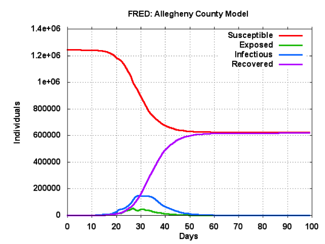
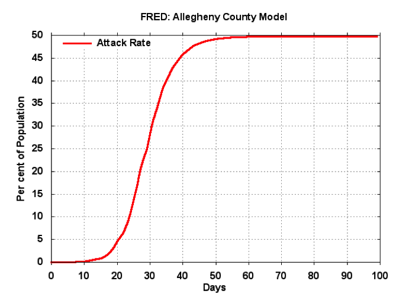
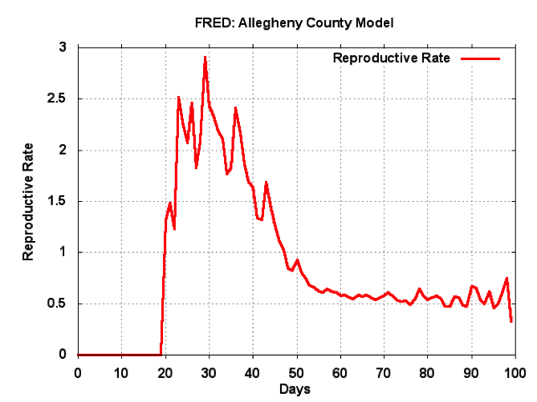
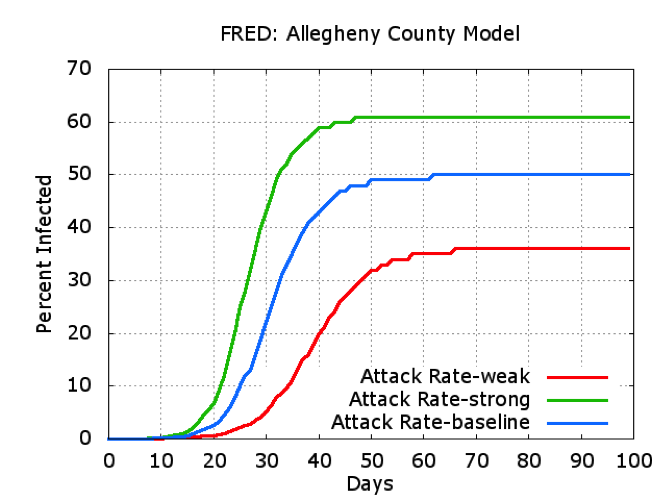
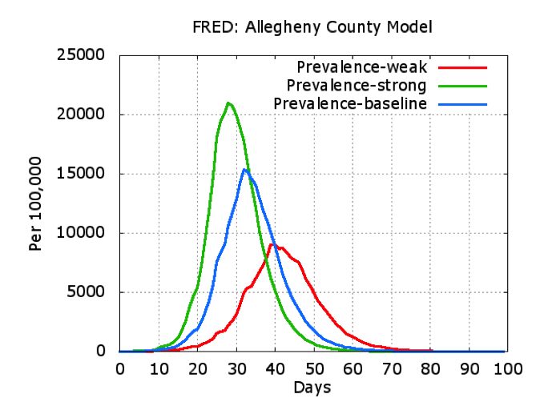
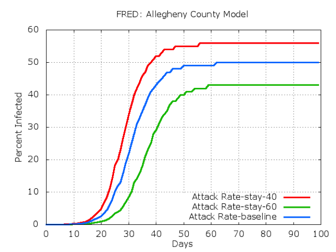
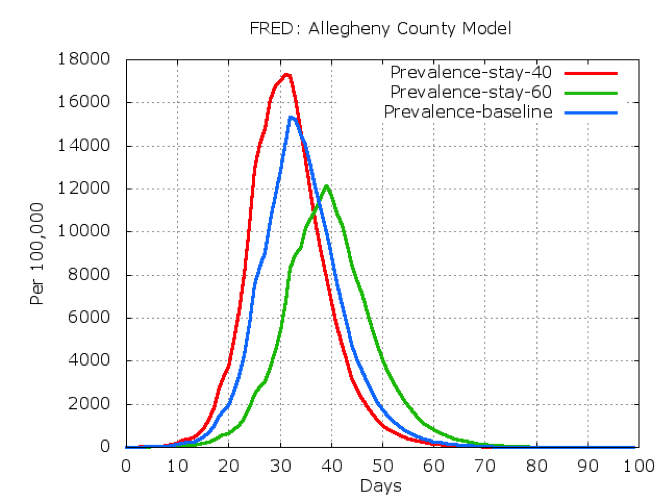

=====================
**FRED User's Guide**
=====================

.. image:: whitespace.pdf
   :width: 3in
   :height: 0.25in

**30 Aug 2013**

.. image:: whitespace.pdf
   :width: 3in
   :height: 0.25in

**John Grefenstette, Jay DePasse, David Galloway, Yu-Ting Weng, Donald Burke**

*University of Pittsburgh*

**Roni Rosenfeld, Alona Fyshe, Anuroop Sriram, Christopher Tischuk**

*Carnegie-Mellon University*

**Shawn Brown, Nathan Stone**

*Pittsburgh Supercomputing Center*

**Phil Cooley, Bill Wheaton**

*RTI International*

.. image:: whitespace.pdf
   :width: 3in
   :height: 4in

**Acknowledgments**

This work was supported by the National Institute of General Medical
Sciences MIDAS grant 1U54GM088491-01, and by the Vaccine Modeling
Initiative, funded by the Bill and Melinda Gates Foundation. The funders
had no role in study design, data collection and analysis, decision to
publish, or preparation of the manuscript.

.. contents:: `Table of Contents`
   :depth: 2

.. raw:: pdf

    PageBreak

Introduction
============

The accelerating growth in data availability and corresponding advances
in high performance computing present new opportunities for *in silico*
analysis of complex public health questions using computational modeling
and simulation. FRED (A Framework for Reconstructing Epidemiological
Dynamics) is an open source, modeling system developed by the University
of Pittsburgh Public Health Dynamics Laboratory in collaboration with
the Pittsburgh Supercomputing Center and the School of Computer Science
at Carnegie Mellon University. FRED supports research on the dynamics of
infectious disease epidemics, and the interacting effects of mitigation
strategies, viral evolution, and personal health behavior. The system
uses agent-based modeling of census-derived synthetic populations
that capture the demographic and geographic distributions of the
population, as well as detailed household, school, and workplace social
networks. Multiple circulating and evolving strains can be simulated. 
Mitigation strategies in the framework include vaccination, anti-viral
drugs, and school closure policies. FRED supports models of health
behavior change to facilitate the study of critical personal health
behaviors such as vaccine acceptance, personal hygiene and spontaneous
social distancing. FRED is available through open source in the hopes
of making large-scale agent-based epidemic models more useful to the
policy-making and research communities, and as a teaching tool
for students in public health.

History
=======

Previous research under the Models of Infectious Disease Agent Study (MIDAS)
program has shown that computer simulation models can provide ways to
evaluate alternative intervention strategies for circumstances that
would be infeasible to study using controlled trials. Previously, our
team has used detailed census-based simulations to examine interventions
in response to influenza pandemics, including vaccination policies (Lee
at al, 2009, 2010a, 2011), school closure (Lee at al, 2010b; Brown et
al, 2011), and the effects of commuting modalities (Cooley at al, 2011).
These studies have shown that computer simulation can often reveal the
relative value of competing health interventions, especially when
considering novel circumstances that cannot be examined through
observational or controlled studies. FRED is based largely on these
previous MIDAS agent simulations, but has been completed redesigned to
support rapid development of new features and a wide range of research
studies.

Overview of this document
=========================

FRED is a research tool and this document is aimed at a target audience
of infectious disease modelers with a high degree of computational
experience. The pragmatics of obtaining, installing and running FRED
have been described in the FRED_ QuickStart_ Guide_. Please refer to that
document for instructions, and some short tutorials. This document will
describe FRED on a conceptual level. Developers will also want to
consult the code-level documentation and even the code itself for
specific implementation details.

.. raw:: pdf

    PageBreak

Synthetic Population
====================

For studies of regions within the United States, FRED uses the 2005-2009
U.S. Synthetic Population Database (Version 2) from RTI International
(Wheaton, 2012). The RTI Synthetic Population uses an iterative fitting
method developed in (Beckman et al, 1996) to generate an agent
population from the US Census Bureau's Public Use Microdata files (PUMs)
and aggregated data from the 2005-2009 American Community Survey (ACS)
5-year sample. The database contains geographically located synthetic
households and household residents for the United States, as well as
group quarters locations and residents, schools and assignments of
students to schools, and workplaces and assignments of workers to
workplaces. Each household, school and workplace is mapped to a specific
geographic location, reflecting the actual spatial distribution of the
area and the distance travelled by individuals to work or to school
(Cajka et al, 2010, Wheaton et al, 2009). Each agent has associated
demographic information (e.g., age, sex) and locations for social
activities (household, and possibly school or workplace).

The remainder of this section is based on the Supplemental Materials
from (Cooley et al, 2011).

Assignment of students to Schools
-------------------------------------

The synthetic population represented schools and assigned persons
of school age to schools using methods described in (Cajka et al.,
2010). Using information from the National Center for Education
Statistics (NCES) a database of all public and private schools in the US
was developed, including each schools geolocation and age-specific
capacity. A set of heuristics were developed to assign each school-age
child to a specific age-appropriate school, using several assumptions
including:

-  Geographic proximity is a major criterion for making assignments.

-  Students are assigned to a school on the basis of distance along a
   network (roads) rather than distance along a straight line.

-  Students attend school only in their county of residence.

-  Students are assigned to a school according to the school's capacity
   for their grade.

-  No special allowances are made to assign siblings to the same school,
   other than the fact that they shared the same geographic location and
   therefore should be assigned to the closest school that had capacity
   for their grade levels.

Workplace Data and Allocation Model
-----------------------------------

The RTI synthetic population also assigned employees to workplaces,
taking into account:

-  the number of persons who lived in one Census tract but worked in
   another and

-  the number of workplaces by size by the same Census tract.

Based on the number of firms by firm size category and Census block
group, synthetic workplaces were created and located at the centroid of
the block group indicated by the workplace's address. Workers were then
assigned to those workplaces so that workers who reported working in a
specific block group were assigned at random to a firm located within
that block group. The workplaces also included schools, hospitals and
other types of institutions that could be used to specifically track
special synthetic agents such as teachers, health care workers, and
others.

One important issue in the Census data (STP64) used for this assignment
of workers is how the Census asks the question that is the source of the 
commuting estimate. Respondents were asked to identify the place they spent 
the most time working at *in the previous week*. This means that the US 
dataset contains data on regular commutes to the individual's typical 
workplace as well as occasional work-related trips. As work trips lasting 
most of a week can be expected to involve longer distances than a typical 
commute, one might attribute the greater than expected number of very long 
distance commutes to such occasional work-related travel.

.. raw:: pdf

    PageBreak

.. _Agent:
.. _Model:

Agent Model
===========

Agents in FRED represent individuals in a population living in a
specific geographic region. For example, many of the initial studies
with FRED model the population of Allegheny County surrounding
Pittsburgh, Pennsylvania.  The model of the population of Allegheny
County includes 1,242,755 agents.  Each agent has
demographic information (e.g., age, date-of-birth, sex), health
information (e.g., current health status, date of infection, level of
symptoms, infectiousness, susceptibility), locations for social activity
(household, neighborhood, and possibly school or workplaces), and
health-related behaviors (e.g., probability of getting a vaccine or
staying home when sick).  During each simulated day, agents interact
with the other agents who share the same social activity locations.  If
an infectious agent interacts with a susceptible agent, there is a
possibility of transmitting a disease from the infected agent to the
susceptible agent.  FRED simulates the population of agents during a
period of time, usually several months, and tracks the spread of disease
among the population. Since each infection event is recorded, it is
possible to analyze the course of an infection through the population,
and to evaluate several possible control measures.  

The main program is contained in ``Fred.cc``. For further details about
the representation of individual agents, see files: ``Person.cc``,
``Population.cc``.

Demographics
------------

The population input file specifies the sex, the age (in years), the
marital status, and the profession of each agent. By default, these
demographic features remain constant during a simulation run. FRED
agents are given a random birthday such that the age in years agrees
with the age listed in the population input file.

FRED also supports dynamic demographics: aging, births and deaths. These
optional features are controlled by the parameters ``enable_aging``,
``enable_births``, and ``enable_deaths``, respectively. If aging is
enabled, then an agent's age increases on each birthday. If births are
enabled, then each female of child-bearing age may become pregnant on
any simulation day using age-specific maternity rates provided in the
``yearly_maternity_rate_file``.  Upon becoming pregnant, the agent is
assigned a due-date based on a Gaussian distribution with a mean of 280
days and a standard deviation of 7 days.  When the due-date arrives, the
mother gives birth to a new agent who is assigned a random sex and is
assigned to the same household as the mother. If death is enabled, then
on each agent's birthday, it is decided whether that agent will die
during the coming year using age-specific mortality rates provided in
the ``yearly_mortality_rate_file``. When an agent dies, it is removed
from the population. For further details, see the source file
``Demographics.cc``.

Health
------

Each agent maintains a list of current infections (one for each
disease). An infection follows a natural history (e.g., latent period,
infectious period, symptomatic period, as well as infectiousness) as
specified via input parameters. Agent's health information also
includes disease status (S, E, I, R), immunity, at-risk status,
susceptibility, current symptom levels, and how many others have been
infected by this agent. See ``Health.cc`` for further details.

Activities
----------

An agent follows a daily pattern of interactions with groups of other
agents. All interactions in FRED occur in a specific place. The types
of places in FRED include: Households, Neighborhoods, School,
Classrooms, Workplaces and Offices. Classrooms are small mixing groups
with a given School. Offices are smaller mixing groups with Workplaces.
Each agent maintains list of "favorite places", at most one for each of
the above types. Agent may have undefined favorite places if they do
not participate in that activity. For example, adults do not have a
defined School or Classroom. On a typical day, the agent interacts with
other agents in each favorite place that is defined.

Neighborhoods are defined on a grid with 1 km square cells. The agent's
home neighborhood is the cell in which its household is located.

However, an agent may visit another neighborhood in the community
during a given day. The decision about where to spend the neighborhood
activity period is made independently each day, with the highest
probability to visit the home neighborhood, and a lesser probability to
visit one of the surrounding neighborhoods, and a small probability of
visiting a randomly selected neighborhood within a given community
radius.

If an agent is infectious, then any location the agent visits during
that day is considered an infectious location. Susceptible agents can
only become infected at an infectious location, so interactions among
agents at non-infectious locations need not be simulated.

Schools are closed on weekends and during scheduled summer holidays.
Schools may also be closed due to school closure policies. Students do
not visit their school when the school is closed.

Similarly, most workers do not visit their workplaces on weekends.
However, some workers are designated as weekend workers, and they
continue to visit workplaces on weekends.

To reflect weekend schedules of schools and workplaces, the number of
neighborhood contacts is increased by 50% on weekends.

See ``Activities.cc`` for more details.

Behaviors
---------

FRED is designed to include any number of health-related behaviors. New
behaviors can be added with minimal programming effort. Each behavior
involves a decision on the willingness of the agent to perform the
behavior. The current set of behaviors includes:

#. **Stay home when sick**: If an adult is symptomatic, is that person
   willing to stay home? If so, the agent withdraws to the household,
   does not interact with other in the neighborhood, at work or at
   school. The agent also does not begin new overnight travel.

#. **Keep child home when sick**: If a child is symptomatic, is the
   child's adult decision-maker willing to have the child withdraw to
   the household. \In this case, the same restrictions on contact apply
   as in the adult "stay at home when sick" behavior.

#. **Accept vaccine**: Is an adult willing to accept a vaccine, if one
   is available?

#. **Accept vaccine for child**: This is the adult's willingness to have
   a child vaccinated.

#. **Accept another vaccine dose**: If a vaccine requires more than one
   dose, is the agent willing to accept an additional dose?

#. **Accept another vaccine does for child**: Same as above, but the
   decision is made by an adult on behalf of a child.

Future behaviors may include: wearing a face mask; taking anti-viral
prophylaxis; staying home when well; keeping children home when well;
avoiding travel; avoiding neighborhood contacts; hand-washing; and
others.

Adult Decision-makers for Children
~~~~~~~~~~~~~~~~~~~~~~~~~~~~~~~~~~

The FRED synthetic population includes information giving the
relationship of each member of the household to the Householder
(typically, the owner of the house or the head of the household.) This
information is used to assign an adult in the household as the
responsible decision-maker for the health-related behaviors of each
child in the household. The rules for selecting the adult
decision-maker for each child are as follows:

#. If the Householder is the parent (natural parent, adoptive parent,
   step-parent) of the child, then the Householder is designated the
   child's decision-maker.

#. If the Householder is the grandparent of the child and there is an
   adult in the householder who is a child of the Householder, then the
   first such adult is designated as the decision-maker for the child.
   Note that the household relationship data does not provide enough
   information to determine whether such an adult is actually the parent
   of the child in question.

#. If the Householder is the grandparent of the child and no plausible
   adult parent is present in the household, then the Householder is
   designated the decision-maker for the child.

#. Otherwise, a random adult in the household is designated as the
   decision-maker for the child.

The rules above permit multiple decision-makers per household. No
preference is made on the basis of sex or age, other than that each
decision-maker is an adult (i.e., at least 18 years old.)

Behavior Strategies
~~~~~~~~~~~~~~~~~~~

How real people make health decisions is an active area of research
without an obvious consensus theory. Indeed, it seems likely that
different people use different methods to come to decisions about
health-related behavior. FRED agents can apply a variety of strategies
to determine their willingness to adopt a given behavior. Each agent may
revisit its willingness to perform the given behavior. Thus each strategy
specification includes a frequency parameter that determines how often
agents make decisions about their willingness to perform the behavior.

#. **Refuse**: Agent is never willing to perform the given behavior.

#. **Accept**: Agent is always willing to perform the given behavior.

#. **Flip Behavior**: Agent is assigned a fixed probability *p* of being
   willing to perform the given behavior. The agent revisits its
   willingness to perform the behavior according to the frequency
   parameter.

#. **Imitate Prevalence**: The agent is assigned an initial probability
   *p* of being willing to perform the given behavior. The agent
   revisits its willingness to perform the behavior according to the
   frequency parameter. When reconsidering the decision, the agent
   estimates the prevalence of willingness among the agents in its
   social networks: household, neighborhood, school and workplace. The
   estimate is a weighted average of the actual prevalence in each
   group. Given the weighted estimate, the agent adjusts its
   probability *p* toward the perceived prevalence. For example, if the
   agent perceives that the prevalence of willingness is 0.75, then it
   adjusts its own probability to be closer to 0.75.

#. **Imitate Consensus:** This strategy is similar to the Imitate
   Prevalence except that if the weighted estimate of prevalence exceeds
   a threshold, the agent adjusts its probability *p* toward 1;
   otherwise the agent adjusts its probability toward 0. For example,
   if the agent's threshold is 0.5, then if the agent perceives that the
   majority of its associates are willing to perform the behavior then
   the agent becomes more likely to accept the behavior; otherwise the
   agent becomes more likely to refuse the behavior.

#. **Imitate by Count**: This strategy is similar to the Imitate
   Consensus except that if the weighted number of nearby agents exceeds
   a threshold, the agent adjusts its probability *p* toward 1;
   otherwise the agents adjusts its probability toward 0. For example,
   if the agent's threshold is 3.0, then if the agent perceives that at
   least three of its associates is willing to perform the behavior then
   the agent becomes more likely to accept the behavior; otherwise the
   agent becomes more likely to refuse the behavior.

#. **Health Belief Model**: According to the Health Belief Model, people
   make health behavior decisions based on several specific
   considerations: susceptibility, severity, benefits, and barriers.

   #. *Perceived Susceptibility* refers to the person's estimate of how
      likely he or she is to become adversely affected by the disease or
      condition;

   #. *Perceived Severity* refers to the level of adverse consequences
      that are perceived to be likely if the person become affected;

   #. *Perceived Benefits* refers to the estimated protective effects of
      the behavior;

   #. *Perceived Barriers* refers to the conditions that may prevent the
      agent from performing the behavior.

These constructs are clearly specific to the particular health behavior
under consideration, so including an HBM strategy for a particular
behavior in FRED requires customized programming. However, once the
perceptions are computed, they can be combined into a decision rule
using formulas developed by David Durham (Durham, 2010). These formulas
have been implemented in the FRED Behavior module, and are controlled by
run-time parameters. (See Parameters_ Section_.)

Each agent is assigned a strategy independently for each behavior
defined for that agent.

Population-Level Market Shares
~~~~~~~~~~~~~~~~~~~~~~~~~~~~~~

For each behavior in FRED, the user may specify the fraction of the
population using each strategy for that behavior. For example, it might
be desirable to investigate the effect of varying the fraction of the
population using the **Accept**, **Refuse**, and **Imitate Consensus**
strategies. The user can specify a given distribution, for example,
20% of the population adopts the **Accept** strategy, 30% adopts the
**Refuse** strategy, and 50% adopt the **Imitate Consensus** strategy
for a given behavior. The share of the population can be specified
separately for each behavior.

See files ``Behavior.cc``, ``Health_Belief_Model.cc`` and
``Random_Behavior_Model.cc`` for further details.

Place Model
===========

All infections in FRED are transmitted from one agent to another in some
particular place. The types of places in FRED include: Households,
Neighborhoods, School, Classrooms, Workplaces and Offices. The synthetic
population files specify the households, school and workplaces in the
modeled region. Neighborhoods, classrooms, and office are created by
FRED using the methods described below.

Neighborhoods are defined on a grid with 1 km square cells. The agent's
home neighborhood is the cell in which its household is located.
However, an agent may visit another neighborhood in the community during
a given day. (See Agent_ Model_ section.)

Classrooms are small mixing groups with a given school. Classrooms are
defined by dividing up all the students who attend a given school into
separate age groups. Each age group is divided into classroom groups of
up to 40 students. A student interacts with the students assigned to
the same classroom for the entire school year. A student also interacts
(with a separate probability) with all the students attending the same
school.

Offices are small mixing groups with a given workplace. Offices are
defined by dividing up all the workers in a given workplace groups of up
to 50 workers. A worker interacts with the other workers in the same
office, and, with a separate rate, with all workers in the same
workplace.

School and classrooms are closed on weekends, during scheduled summer
breaks, and possibly due to school closure policies.

For further details, see files: ``Place_List.cc``, ``Place.cc``,
``Household.cc``, ``Neighborhood.cc``, ``School.cc``, ``Classroom.cc``,
``Workplace.cc``, ``Office.cc``.

.. raw:: pdf

    PageBreak

Disease Model
=============

FRED supports multiple diseases circulating in the same population.
Each Disease has separate parameters specifying transmissibility,
mortality rate, its natural history (e.g., latent period, infectious
period, symptomatic period). See ``Disease.cc``

Each disease has an associated Epidemic object that keeps track of
population level statistics associated with the disease, such as the
number of agents that are Susceptible, Exposed, Infectious and
Recovered. The Epidemic object prints out the daily reports to the
output file. See ``Epidemic.cc``.

Transmission Model
------------------

The core phenomenon of an epidemic in FRED is the spread of an infection
from one agent to another in a particular place. Each type of place
represents a distinct environment for the spread of infection. Each
type of place is characterized by two sets of numeric parameters:

-  the number of contacts per infectious person per day, and

-  the probability that a contact transmits an infection

The number of contacts per day for each type of place is a tunable
parameter, and is set through the process described in the Calibration_
Section.

The transmission probability for a give place type generally depends on
the age of the infectious person and the susceptible person. These are
specified as vector input parameters.

The key method implementing infection is called
``Place::spread_infection()`` in ``Place.cc``. This method is called
once a day for each infectious place (having at least one infectious
visitor). The method follows the following procedure:

::

  For each infectious person i, the expected number of contacts is:
      Num_contacts(i) = Trans(D) * CR(P) * Inf(i) * S(P)/N(P)
      where:
	Trans(D) = the transmissibility factor for disease D,
      	CR(P) = the contact rate for place P,
      	Inf(i) = the infectivity of agent i,
      	S(P) = the number of susceptible agents visiting place P, and
      	N(P) = the number of total agents who usually visit place P

  For contact number 1 .. Num_contacts(i)
    pick a susceptible agent j from today's visitors;
    let PROB = Trans_prob(i.j) \ Sus(j)
    where
	Trans_prob(i.j) = the transmission probability from i to j, and
	Sus(j) = the susceptibility of agent j.
    If a random number R is less than PROB, then agent i infects agent j.

For further details, see ``Place.cc``, ``Household.cc``

.. _Calibration:

Pandemic influenza model parameterization
-----------------------------------------

FRED is parameterized for a default pandemic influenza strain following
the process described in (Cooley P, Brown S, Cajka J, Chasteen B,
Ganapathi L, Grefenstette J, Hollingsworth CR, Lee BY, Levine B, Wheaton
WD, Wagener DK. The Role of Subway Travel in an Influenza Epidemic: A
New York City Simulation. J Urban Health. 2011 Aug 9. [Epub ahead of
print] PubMed PMID: 21826584.) Paraphrasing the Supplementary Material
from (Cooley et al, 2011):

The pandemic was assumed to have the age-dependent attack rate pattern
of the historical 1957-8 "Asian" influenza A (H2N2), see Longini et al.
Accordingly, we calibrated our model using the Ferguson et al. approach
from historical (1957-58, 1968-69) influenza pandemics. We specifically
used the 30-70 rule developed by Ferguson et al. in which 70% of all
transmission occurred outside the household: 33% in the general
community and 37% in schools and workplaces.

Following (Cooley et al, 2011), we adopted that additional requirement
that transmission rates in schools are double those in workplaces.
Calibrating the model involved targeting an epidemic with a 33% attack
rate (AR) consistent with the age specific parameters derived from the
1957-58 pandemic. Daily contact rates were treated as endogenous
parameters and were interpreted as the daily contact rates that
reproduced a pandemic with a 33% AR in a population with no acquired
immunity and satisfied the 30-70 rule. Therefore, our estimated contact
patterns produced an epidemic designed to be similar in transmissibility
to the 1957-58 epidemic with an AR of 33% and a basic reproductive rate
(R0) of approximately 1.4.

The calibration process using the Allegheny County synthetic population
results in the following default parameters:

   ``neighborhood_contacts[0] = 42.478577``
   
   ``school_contacts[0] = 14.320478``
   
   ``workplace_contacts[0] = 1.589467``

By default, the contact rates for classrooms are double those for the
school in general.  Likewise, the contact rates for offices are double
those for workplaces in general.  These heuristic are based on the idea
that individuals sustain more contacts within their smaller mixing groups
at school and at work.

As in (Cooley et al, 2011) we assumed that 50% of sick individual stay
at home and do not interact with anyone outside of the household. Note
that our default school absentee rate is generally lower than other
models (e.g., Ferguson et al. use a 90% absentee rate). Additionally, we
assumed that all community contacts increase by 50% on weekends.

Contacts within Household
~~~~~~~~~~~~~~~~~~~~~~~~~

Calibration to the 30-70 target criteria was impossible unless within
household contacts were treated differently than other locations.
Following (Cooley at al, 2011), we assumed that each pair of agents
within a household make contact each day with a specified probability.
This probability is tuned as part of the calibration step to achieve
the 30-70 target distribution. The resulting contact probability for
Allegheny County is:

	  ``household_contacts[0] = 0.198226``

.. raw:: pdf

    PageBreak

Interventions
=============

Vaccines
--------

FRED provides a fairly robust capability for simulating the use of
vaccines during a pandemic. Multiple vaccines can be simulated
simultaneously, with differing administration schedules and target
groups, and with different efficacies. Each vaccine can also have
multiple doses and be restricted by age. It is also possible to model
varied vaccines schedules by day. Prioritization by age groups, or by
ACIP recommendation is available with the capability to vaccinate only
the priority group. Currently, vaccines can only be applied to one
disease.

Vaccines in FRED are currently modeled as so-called "all or nothing"
vaccines. Each vaccine is given an age-specific efficacy and efficacy
delay. When an agent takes a vaccine, there is a random draw to
determine whether the vaccine will be efficacious for that agent. If it
is not, then the vaccine has no effect until another vaccine or dose is
administered. If the vaccine dose is efficacious, then the agent will
become immune to the disease after the specified efficacy delay. As in
real life, the agent has no knowledge as to whether their dose of
vaccine was efficacious, and so if they are exposed after a failed
vaccine or during the delay period, they may get sick from the disease.

Vaccination programs currently implemented can be thought of as mass
vaccination strategies. At the beginning of the simulation, a set of
queues is set up based on prioritization of the agents. These queues
are then randomized and as vaccines are put into the system, agents can
choose whether or not to accept a vaccine. To determine this decision,
the simulation can use a straight coverage probability, or a more
complex behavioral model. Heads of households can make decisions for
younger members.

Antiviral drugs
---------------

FRED provides the ability to simulate the use of antivirals. 
Use of multiple antivirals can be modeled simultaneously. Modifiable antiviral 
characteristics include the length of antiviral treatment, the reduction in 
infectivity and susceptibility due to treatment, the efficacy of the antiviral, 
the amount of antiviral initially and currently available, and the start date 
for administration. The stock of an antiviral may be increased daily. Viral 
evolution can change the efficacy of an antiviral.
Antivirals can modify the infectivity, susceptibility, and symptomaticity of 
an agent (through that agent's Health). Antivirals have distribution policies 
that determine to whom they are given. An antiviral may be designated as being 
used for prophylaxis.

School closure
--------------

FRED includes two school closure policies: global and individual. There
are two triggers for the global school closure policy
(``school_closure_policy = global``). First, all schools decide to close
on the simulation day specified by the parameter ``school_closure_day``,
unless that parameter is negative. Second, all schools decide to close
if the population attack rate exceeds a threshold
(``school_closure_threshold``). With either trigger, school closure is
delayed by a number of days indicated by the parameter
``school_closure_delay``. Schools reopen after a number of days
indicated by the parameter ``school_closure_period``.

If the individual school closure policy is selected
(``school_closure_policy = individual``), then the parameters for
the attack rate used as threshold
(``school_closure_threshold``),  delay
(``school_closure_delay``), and reopen
(``school_closure_period``) are used as for global closure.
Schools may close again if the school attack rate exceeds the threshold.

The default is no school closure policy: ``school_closure_policy =
none``

School are always closed on weekends. All schools also close for the
summer if the parameter ``school_summer_schedule`` is set. In that case,
schools are closed between the dates specified by parameters
``school_summer_start`` and ``school_summer_end``, inclusive.

For details, see ``School.cc``.

Future Interventions
--------------------

It is planned to include other interventions in FRED, including:
quarantine; travel restrictions; environmental interventions (e.g.,
vector control); behavioral changes; official announcements and
warnings; and education campaigns.

.. raw:: pdf

    PageBreak

Geography and Travel
====================

FRED represents geography as a hierarchy of fixed square grids.
Currently there are three layers in the hierarchy, called Large Grid,
Grid, and Small Grid.

The Large Grid consists of 20km x 20km cells by default. The Large Grid
is an aligned global geo-coordinate system. Cells in the Large Grid store
the population count for the cell, along with a vector of all persons
residing in that cell. The Large Grid can also be used to store
climate or other environmental profiles (see **Seasonality** below).

The medium grid, called ``Grid``, consists of 1km x 1km cells by default.
These cells function as neighborhood units, and store information about
the preferred schools and workplaces attended by people living with the
cells. This information is used when agents need to change schools, or
leave school and start to work.

The Small Grid consists of 10m x 10m cells. In the future, these cells
will store fine-resolution information like the number of mosquitoes and
the presence of water containers.

For further details, see source files: ``Large_Grid.cc``, ``Large_Cell.cc``,
``Grid.cc``, ``Cell.cc``, ``Small_Grid.cc``, ``Small_Cell.cc``.

As an optional feature, agents can travel overnight for one or more
days. When an agent is on overnight travel, the traveling agent (called
the "visitor") resides in the household associated with another agent
(called the "visited agent"). The visitor interacts with agents in the
visited agent's household and neighborhood. If the visitor is employed,
then the visitor also interacts with the visited agent's office and
workplace. Visitors do not attend school while traveling.

If travel is enabled, two additional input files are required, a cell
population file and a trip list file. The cell population file contains
the total population for each cell, considering the entire U.S.
population. The trip list file contains a large sample of trips from
one cell to another. This file covers the entire U.S. The trip file
can contain samples based on data obtained from air travel databases or
from any other source considered appropriate. The current default is a
sample of 5 million cell-to-cell trips based on a gravity model of
travel, using the formula:

	Prob_travel(i,j) = Pop(i) * Pop(j) / (K * Distance(i,j))

where ``Pop(i)`` is the total population residing in cell ``i`` (derived from
the entire U.S. synthetic population), ``Distance(i,j)`` is the distance in
kilometers between the center of cells ``i`` and ``j``, and ``K`` is a normalization
factor so that ``Prob_travel(i,j)`` sums to 1.0. Given the pdf defined by
the above formula, we select 5 million trips (with replacement) and
store these in the trip list file.

During the ``Travel::setup()`` method, the trip list sample is read, and
those trips involving the model region are retained. The number of
daily trips involving the population in the model region is proportional
to the fraction of the retained trips. The goal is that the expected
number of overnight trips involving agents in the modeled regions
remains invariant, regardless of the size of the model region.

The cell population file is used to set the probability of initiating a
trip between two cells. If a trip between cells ``i`` and ``j`` is selected, it
is only initiated with probability ``dens(i) * dens(j)``, where ``dens(i)`` is
the fraction of the total population in cell ``i`` that actually occurs in
the synthetic population for the current model region. For example, if
cell ``i`` is on the border of the model region and happens to contains only
50% of the entire cell population according to the current model
population, then the probability of any trip to or from cell ``i`` is
reduced by 50%.

Trip duration is controlled by a variable whose values were drawn from the U.S 
Department of Transportation National Household Survey.
See the ``travel_duration`` parameter description.

Frequency of travel of individual agents is based upon their ages. This value is 
also derived from the National Household Survey and is controlled by the ``travel_age_prob_ages``
and ``travel_age_prob_values`` parameters. These parameters are used to create a mapping of age to
frequency of travel. For details on the age map see ``Age_Map.h`` and ``Age_Map.cc``. 

Seasonality and Climate
=======================

It is possible to alter the transmissibility of diseases througout the
simulation run.  A time-series profile of seasonality values that are
used to scale the disease transmissibility is specified with the
parameter ``seasonality_timestep_file``.  This file allows recurring
seasonal forcing patterns to be given using Month-Day calendar dates or
'simulation days'.  Optionally, the seasonality multiplier may be varied
over FRED's **Large Grid** layer.  The format of the
``seasonality_timestep_file`` is similar to that of the
``multistrain_timestep_file`` and is described in detail below_.

Seasonality vs. Climate
-----------------------

The Seasonality feature of FRED has two basic modes of operation: the
default in which the seasonality values are interpreted simply as direct
multipliers to transmissibility and another ('**climate mode**') in
which the values in the profile are interpreted as absolute (specific)
humidity and transformed according to a Disease-specific function
hardcoded in the **Disease** class.

The default function found in ``Disease.cc`` is:

    multiplier = exp(((seasonality_Ka * seasonality_value) + seasonality_Kb)) + seasonality_min

The parameters governing the interpretation of the values given in the 
``seasonality_timestep_file`` are described under Seasonal_ Forcing_ Parameters.

.. raw:: pdf

    PageBreak

.. _Parameters: 
.. _Section:

Run-time Parameters
===================

The run-time parameters for FRED are contained in two parameter files.
The first file is ``$FRED_HOME/input_files/params.default`` and
contains the default values of all defined run-time parameters. **This
file should not be modified by the user.** The second file is usually called
``params`` and contains any parameter values that override the default
values. The ``params`` file must exist but it may be empty.

Both files have the same format. Lines that begin with a ``#`` character
are considered comments and are ignored. Parameters with scalar values
are specified with lines of the form:

``<name> = <value>``

For example:

  days = 100
  
  diseases = 1
  
  city = Pittsburgh, PA

Some parameters are vector valued, in which case the format is:

``<`` *name* ``> = <`` *size* ``>`` *v_1 v_2 ... v_size*

For example:

  # cdf of trip duration in days
  
  travel_duration = 6 0 0.2 0.4 0.6 0.8 1.0

If a parameter appears more than once in a parameter file, the last
setting takes precedence. If a parameter appears in both
``params.default`` and ``params``, the value in ``params`` overrides the
value in ``params.default``.

Simulation Initialization Parameters
-------------------------------------

Table 5.1: Simulation Initialization Parameters

+---------------------------------------+----------+---------------------------------------------------------------------------------+
| Parameter = <default value>           | Type     | Definition and Notes                                                            |
+=======================================+==========+=================================================================================+
| ``diseases = 1``                                                                                                                   |
+---------------------------------------+----------+---------------------------------------------------------------------------------+
|                                       | int      | The number of diseases circulating in the population. Any  number of diseases   |
|                                       |          | is allowed.  Runtime and memory required is proportional to the number of       |
|                                       |          | diseases.                                                                       |
+---------------------------------------+----------+---------------------------------------------------------------------------------+
| ``days = 240``                                                                                                                     |
+---------------------------------------+----------+---------------------------------------------------------------------------------+
|                                       | int      | The number of days in a single simulation run. FRED runs for the given number   |
|                                       |          | of days regardless of the epidemic state (that is, FRED  does not stop early    |
|                                       |          | if no one is currently infected.)                                               |
+---------------------------------------+----------+---------------------------------------------------------------------------------+
| ``seed = 123456``                                                                                                                  |
+---------------------------------------+----------+---------------------------------------------------------------------------------+
|                                       | int      | The seed for the random number generator. The seed values for all runs of the   |
|                                       |          | simulation are based on the initial seed and the run number, and are            |
|                                       |          | independent of the number of random numbers generated in other runs.            |
+---------------------------------------+----------+---------------------------------------------------------------------------------+
| ``start_date = 2012-01-02``                                                                                                        |
+---------------------------------------+----------+---------------------------------------------------------------------------------+
|                                       | string   | Simulation start date in the format YYYY-MM-DD.                                 |
+---------------------------------------+----------+---------------------------------------------------------------------------------+
| ``rotate_start_date = 0``                                                                                                          |
+---------------------------------------+----------+---------------------------------------------------------------------------------+
|                                       | int      | Whether to rotate through 7 start dates on multiple runs                        |
+---------------------------------------+----------+---------------------------------------------------------------------------------+
| ``reseed_day = -1``                                                                                                                |
+---------------------------------------+----------+---------------------------------------------------------------------------------+
|                                       | int      | If ``reseed_day > -1``, start each run with the same random seed and then reset |
|                                       |          | the seed at day reseed_day. The effect is that the initial days will follow the |
|                                       |          | same trajectory, but the simulations will follow independent trajectories       |
|                                       |          | starting on ``reseed_day``. This permits estimation of conditional variance.    |
+---------------------------------------+----------+---------------------------------------------------------------------------------+
| ``enable_small_grid = 0``                                                                                                          |
+---------------------------------------+----------+---------------------------------------------------------------------------------+
|                                       | int      | If set, enables the high resolution geographical grid.                          |
+---------------------------------------+----------+---------------------------------------------------------------------------------+
| ``use_mean_latitude = 0``                                                                                                          |
+---------------------------------------+----------+---------------------------------------------------------------------------------+
|                                       | int      | If ``use_mean_latitude = 1``, then the mean latitude in the households file     |
|                                       |          | is used for the planar projection from (longitude,latitude) to (x,y)            |
|                                       |          | coordinates.  This is recommended for regions substantially North or South      |
|                                       |          | from the US mean latitude.  If set to 0 (the default), then the mean US         |
|                                       |          | latitude is used.                                                               |
+---------------------------------------+----------+---------------------------------------------------------------------------------+
| ``grid_large_cell_size = 20.0``                                                                                                    |
+---------------------------------------+----------+---------------------------------------------------------------------------------+
|                                       | float    | Size of large-scale grid cells in km.                                           |
+---------------------------------------+----------+---------------------------------------------------------------------------------+
| ``grid_cell_size = 1.0``                                                                                                           |
+---------------------------------------+----------+---------------------------------------------------------------------------------+
|                                       | float    | Size of normal grid cells in km.                                                |
+---------------------------------------+----------+---------------------------------------------------------------------------------+
| ``grid_small_cell_size = 0.1``                                                                                                     |
+---------------------------------------+----------+---------------------------------------------------------------------------------+
|                                       | float    | Size of high resolution grid cells in km.                                       |
+---------------------------------------+----------+---------------------------------------------------------------------------------+

Output Control Parameters
-------------------------

FRED produces several output files. The level of detail can be
controlled by the following parameters:

Table 5.2: Output Control Parameters

+---------------------------------------+----------+---------------------------------------------------------------------------------+
| Parameter = <default value>           | Type     | Definition and Notes                                                            |
+=======================================+==========+=================================================================================+
|     ``verbose = 1``                                                                                                                |
+---------------------------------------+----------+---------------------------------------------------------------------------------+
|                                       |  int     | If set, print information for monitoring system progress to the standard        |
|                                       |          | output. Higher values produce more output.                                      |
+---------------------------------------+----------+---------------------------------------------------------------------------------+
| ``debug = 0``                                                                                                                      |
+---------------------------------------+----------+---------------------------------------------------------------------------------+
|                                       | int      | If set, print verbose debugging output to stdout. Higher values produce more    |
|                                       |          | output.                                                                         |
+---------------------------------------+----------+---------------------------------------------------------------------------------+
| ``test = 0``                                                                                                                       |
+---------------------------------------+----------+---------------------------------------------------------------------------------+
|                                       | int      | If set, print test output to stdout. Higher values produce more                 |
|                                       |          | output.                                                                         |
+---------------------------------------+----------+---------------------------------------------------------------------------------+
|  ``outdir = OUT``                                                                                                                  |
+---------------------------------------+----------+---------------------------------------------------------------------------------+
|                                       |  string  | Directory containing the output files. If the string beings with "/" it is      |
|                                       |          | interpreted as an absolute path. Otherwise, it is relative to the current       |
|                                       |          | working directory.                                                              |
+---------------------------------------+----------+---------------------------------------------------------------------------------+
|  ``tracefile = none``                                                                                                              |
+---------------------------------------+----------+---------------------------------------------------------------------------------+
|                                       |  string  |                                                                                 |
+---------------------------------------+----------+---------------------------------------------------------------------------------+
| ``track_infection_events = 0``                                                                                                     |
+---------------------------------------+----------+---------------------------------------------------------------------------------+
|                                       | int      | If set, then a file called ``infections<n>.txt`` is created for ``run <n>``.    |
|                                       |          | This file contains one line per disease transmission event, showing the id      |
|                                       |          | of the infector, the infectee, and various other information.  The format for   |
|                                       |          | the infections file is:                                                         |
|                                       |          |                                                                                 |
|                                       |          | ``DAY DISEASE_ID HOST_ID HOST_AGE`` ``INFECTOR_ID INFECTOR_AGE PLACE_ID``       |
|                                       |          |                                                                                 |
|                                       |          | If ``track_infection_events > 1``, additional data is written on each line.     |
|                                       |          | For further details, see: ``Infection.cc``.                                     |
+---------------------------------------+----------+---------------------------------------------------------------------------------+
| ``track_age_distribution = 0``                                                                                                     |
+---------------------------------------+----------+---------------------------------------------------------------------------------+
|                                       | int      |                                                                                 |
+---------------------------------------+----------+---------------------------------------------------------------------------------+
| ``track_household_distribution = 0``                                                                                               |
+---------------------------------------+----------+---------------------------------------------------------------------------------+
|                                       | int      |                                                                                 |
+---------------------------------------+----------+---------------------------------------------------------------------------------+
| ``track_network_stats = 0``                                                                                                        |
+---------------------------------------+----------+---------------------------------------------------------------------------------+
|                                       | int      |                                                                                 |
+---------------------------------------+----------+---------------------------------------------------------------------------------+
| ``report_age_of_infection = 0``                                                                                                    |
+---------------------------------------+----------+---------------------------------------------------------------------------------+
|                                       | int      |                                                                                 |
+---------------------------------------+----------+---------------------------------------------------------------------------------+
| ``report_place_of_infection = 0``                                                                                                  |
+---------------------------------------+----------+---------------------------------------------------------------------------------+
|                                       | int      |                                                                                 |
+---------------------------------------+----------+---------------------------------------------------------------------------------+
| ``report_distance_of_infection = 0``                                                                                               |
+---------------------------------------+----------+---------------------------------------------------------------------------------+
|                                       | int      |                                                                                 |
+---------------------------------------+----------+---------------------------------------------------------------------------------+
| ``report_presenteeism = 0``                                                                                                        |
+---------------------------------------+----------+---------------------------------------------------------------------------------+
|                                       | int      |                                                                                 |
+---------------------------------------+----------+---------------------------------------------------------------------------------+
| ``report_county_incidence = 0``                                                                                                    |
+---------------------------------------+----------+---------------------------------------------------------------------------------+
|                                       | int      |                                                                                 |
+---------------------------------------+----------+---------------------------------------------------------------------------------+
| ``quality_control = 1``                                                                                                            |
+---------------------------------------+----------+---------------------------------------------------------------------------------+
|                                       | int      | If set, information about the size and age distribution for the various types   |
|                                       |          | of places is printed out in the Log file.                                       |
+---------------------------------------+----------+---------------------------------------------------------------------------------+
| ``print_household_locations = 0``                                                                                                  |
+---------------------------------------+----------+---------------------------------------------------------------------------------+
|                                       | int      | If set, a file called ``households.txt`` is printed in the output directory     |
|                                       |          | with format:HOUSE_LABEL LON LAT  X Y ID GRID_ROW GRID_COL GRID_HOUSE_NUMBER     |
+---------------------------------------+----------+---------------------------------------------------------------------------------+
| ``rr_delay = 10``                                                                                                                  |
+---------------------------------------+----------+---------------------------------------------------------------------------------+
|                                       | int      | Identifies the number of days between the definition of a cohort and the        |
|                                       |          | reporting of that cohort's reproductive rate in the output file.                |
+---------------------------------------+----------+---------------------------------------------------------------------------------+
| ``print_gaia_data = 0``                                                                                                            |
+---------------------------------------+----------+---------------------------------------------------------------------------------+
|                                       | int      | If set, generates data for use by Gaia.                                         |
+---------------------------------------+----------+---------------------------------------------------------------------------------+
| ``incremental_trace = 0``                                                                                                          |
+---------------------------------------+----------+---------------------------------------------------------------------------------+
|                                       | int      |                                                                                 |
+---------------------------------------+----------+---------------------------------------------------------------------------------+
| ``trace_headers = 0``                                                                                                              |
+---------------------------------------+----------+---------------------------------------------------------------------------------+
|                                       | int      |                                                                                 |
+---------------------------------------+----------+---------------------------------------------------------------------------------+
| ``output_population = 0``                                                                                                          |
+---------------------------------------+----------+---------------------------------------------------------------------------------+
|                                       | int      | If set, a file containing the current population will be output periodically.   |
|                                       |          | See explanation below.                                                          |
+---------------------------------------+----------+---------------------------------------------------------------------------------+
| ``pop_outfile = pop_out``                                                                                                          |
+---------------------------------------+----------+---------------------------------------------------------------------------------+ 
|                                       | string   | Name of population dump file.                                                   |
+---------------------------------------+----------+---------------------------------------------------------------------------------+
| ``output_population_date_match = 01-01-*``                                                                                         |
+---------------------------------------+----------+---------------------------------------------------------------------------------+
|                                       | string   | If ``output_population`` is set, dump the population on any date that matches   |
|                                       |          | this string. The format is ``DD-MM-YY``, with ``*`` matching any value.         |   
+---------------------------------------+----------+---------------------------------------------------------------------------------+

Periodic Population Dumps
~~~~~~~~~~~~~~~~~~~~~~~~~~~

If the parameter ``output_population = 1``, then a file will be written on
the start day, the end day, and on any day matching
``output_population_date_match parameter``. The file will be a dump of
the population that will be identical to the input population file, but
will have additional fields for the classroom and office ids (which are
both set at runtime).

Population Parameters
-------------------------------

+---------------------------------------+----------+---------------------------------------------------------------------------------+
| Parameter = <default value>           | Type     | Definition and Notes                                                            |
+=======================================+==========+=================================================================================+
| ``synthetic_population_directory = $FRED_HOME/populations``                                                                        |
+---------------------------------------+----------+---------------------------------------------------------------------------------+
|                                       |  string  | Location of the synthetic population files.                                     |
+---------------------------------------+----------+---------------------------------------------------------------------------------+
| ``synthetic_population_id = 2005_2009_ver2_42003``                                                                                 |
+---------------------------------------+----------+---------------------------------------------------------------------------------+
|                                       |  string  | Defaults to Allegheny County Population (RTI Ver 2).                            |
+---------------------------------------+----------+---------------------------------------------------------------------------------+
| ``num_demes = 1``                                                                                                                  |
+---------------------------------------+----------+---------------------------------------------------------------------------------+
|                                       | int      | Deme is a local population of people whose households are contained in the      |
|                                       |          | same bounded geographic region. See explanation below.                          |
+---------------------------------------+----------+---------------------------------------------------------------------------------+
| ``msa = none``                                                                                                                     |
+---------------------------------------+----------+---------------------------------------------------------------------------------+
|                                       | string   | This parameter enables the use of Metropolitan and Micropolitan Statistical     |
|                                       |          | Areas. See explanation below.                                                   |
+---------------------------------------+----------+---------------------------------------------------------------------------------+
| ``fips = none``                                                                                                                    |
+---------------------------------------+----------+---------------------------------------------------------------------------------+
|                                       |  string  | If set, has highest precedence and overrides city, state and county. See        |
|                                       |          | explanation below.                                                              |
+---------------------------------------+----------+---------------------------------------------------------------------------------+
| ``city = none``                                                                                                                    |
+---------------------------------------+----------+---------------------------------------------------------------------------------+
|                                       |  string  | If set, overrides state and county.  Format is "name state_abbreviation".       |
+---------------------------------------+----------+---------------------------------------------------------------------------------+
| ``county = none``                                                                                                                  |
+---------------------------------------+----------+---------------------------------------------------------------------------------+
|                                       |  string  | If set, overrides state.  Format is "name state_abbreviation".                  |
+---------------------------------------+----------+---------------------------------------------------------------------------------+
| ``state = none``                                                                                                                   |
+---------------------------------------+----------+---------------------------------------------------------------------------------+
|                                       |  string  | The state format can be the state name or abbreviation, such as:                |
|                                       |          | ``state = New York`` or ``state = NY``.                                         |
+---------------------------------------+----------+---------------------------------------------------------------------------------+
| ``synthetic_population_version = 2005_2009_ver2``                                                                                  |
+---------------------------------------+----------+---------------------------------------------------------------------------------+
|                                       | string   | The synthetic_population_version will be prepended to the FIPS code to          |
|                                       |          | generate the synthetic_population_id.                                           |
+---------------------------------------+----------+---------------------------------------------------------------------------------+
| ``enable_hospitals = 0``                                                                                                           |
+---------------------------------------+----------+---------------------------------------------------------------------------------+
|                                       | int      | Optional support for hospitals.                                                 |
+---------------------------------------+----------+---------------------------------------------------------------------------------+
| ``enable_group_quarters = 0``                                                                                                      |
+---------------------------------------+----------+---------------------------------------------------------------------------------+
|                                       | int      | Optional support for group quarters (dormitories, barracks, etc.).              |
+---------------------------------------+----------+---------------------------------------------------------------------------------+
| ``enable_local_workplace_assignment = 0``                                                                                          |
+---------------------------------------+----------+---------------------------------------------------------------------------------+
|                                       | int      |  If set, then all workers who have a workplace outside the location file        |
|                                       |          |  are assigned a random workplace in the location file.                          |
+---------------------------------------+----------+---------------------------------------------------------------------------------+
| ``community_distance = 20``                                                                                                        |
+---------------------------------------+----------+---------------------------------------------------------------------------------+
|                                       | int      | Used when deciding where to spend an agent's neighborhood time,                 |
|                                       |          | see explanation below.                                                          |
+---------------------------------------+----------+---------------------------------------------------------------------------------+
| ``community_prob = 0.1``                                                                                                           |
+---------------------------------------+----------+---------------------------------------------------------------------------------+
|                                       | int      | Used when deciding where to spend an agent's neighborhood time,                 |
|                                       |          | see explanation below.                                                          |
+---------------------------------------+----------+---------------------------------------------------------------------------------+
| ``home_neighborhood_prob = 0.5``                                                                                                   |
+---------------------------------------+----------+---------------------------------------------------------------------------------+
|                                       | int      | Used when deciding where to spend an agent's neighborhood time,                 |
|                                       |          | see explanation below.                                                          |
+---------------------------------------+----------+---------------------------------------------------------------------------------+
| ``enable_aging = 0``                                                                                                               |
+---------------------------------------+----------+---------------------------------------------------------------------------------+
|                                       | int      |                                                                                 |
+---------------------------------------+----------+---------------------------------------------------------------------------------+
| ``enable_births = 0``                                                                                                              |
+---------------------------------------+----------+---------------------------------------------------------------------------------+
|                                       | int      | If set, new agents are added to the population as births.                       |
+---------------------------------------+----------+---------------------------------------------------------------------------------+
| ``enable_deaths = 0``                                                                                                              |
+---------------------------------------+----------+---------------------------------------------------------------------------------+
|                                       | int      | If set, agents are removed from the population based on age-specific mortality. |
+---------------------------------------+----------+---------------------------------------------------------------------------------+
| ``enable_mobility = 0``                                                                                                            |
+---------------------------------------+----------+---------------------------------------------------------------------------------+
|                                       | int      |                                                                                 |
+---------------------------------------+----------+---------------------------------------------------------------------------------+
| ``enable_migration = 0``                                                                                                           |
+---------------------------------------+----------+---------------------------------------------------------------------------------+
|                                       | int      |                                                                                 |
+---------------------------------------+----------+---------------------------------------------------------------------------------+
| ``yearly_mortality_rate_file = none``                                                                                              |
+---------------------------------------+----------+---------------------------------------------------------------------------------+
|                                       |  string  | File of age-specific mortality rates.                                           |
+---------------------------------------+----------+---------------------------------------------------------------------------------+
| ``yearly_mobility_rate_file = none``                                                                                               |
+---------------------------------------+----------+---------------------------------------------------------------------------------+
|                                       |  string  |                                                                                 |
+---------------------------------------+----------+---------------------------------------------------------------------------------+
| ``yearly_birth_rate_file = none``                                                                                                  |
+---------------------------------------+----------+---------------------------------------------------------------------------------+
|                                       |  string  | File of age-specific rate at which female agents give birth.                    |
+---------------------------------------+----------+---------------------------------------------------------------------------------+
| ``birth_rate_multiplier = 1``                                                                                                      |
+---------------------------------------+----------+---------------------------------------------------------------------------------+ 
|                                       | int      |                                                                                 |
+---------------------------------------+----------+---------------------------------------------------------------------------------+

The synthetic_population_id parameter is the default determinant of the population files used in FRED.
The paramers ``FIPS code``, ``city name``, ``county name``, and ``state name``, if set, will override the default, in that order of precedence.
That is, a FIPS code overrides a city name, which overrides county and so on.  In all cases, the name is ultimately transformed into a FIPS code.

    ``# For Allegheny County, PA:``
    
      ``fips = 42003``
    

    ``# The city format is "name state_abbreviation", such as:``
    
      ``city = Pittsburgh PA``
    

    ``# The county format is "name state_abbreviation", such as:``
    
      ``county = Allegheny County PA``
    

    ``# The state format can be the state name or abbreviation, such as:``
    
      ``state = New York``
      
      ``state = NY``
 
FRED defines a **deme** to be a local population of people whose households are contained in the same bounded geographic region. The 
``synthetic_population_id`` is used to define demes. No Synthetic Population ID may have more than one Deme ID, but a Deme ID may contain 
many Synthetic Population IDs. One deme is defined by default. To create a deme with more than one contiguous county, 
set the ``synthetic_population_id`` to a space delimited list of population ids.

    ``synthetic_population_id = 2005_2009_ver2_42003 2005_2009_ver2_42007``

To use more than one deme, set the number of demes and set additional synthetic population ids using array notation.

    ``num_demes = 2``
      
    ``synthetic_population_id = 2005_2009_ver2_42003`` 
      
    ``synthetic_population_id[1] = 2005_2009_ver2_42007``
     
Only the Allegheny County population files are included in the FRED download. Additional population files must be downloaded from 
`<https://www.epimodels.org/midas/Rpubsyntdata1.do>`__ and unzipped in the ``populations`` directory.

Metropolitan and Micropolitan Statistical Areas are Core Based Statistical Areas (CBSAs) defined by the U.S. Office of Management 
and Budget. CBSAs consist of a central urban area or urban cluster and are contiguous regions of relatively high population density, 
consisting of a central county and outlying counties tightly tied to the central county by commercial and commuting patterns. 
Metropolitan Statistical Areas have a core city of population 50,000 or greater. Micropolitan Statistical Areas have a core city 
of population 10,000 to 50,000. Some ares of the U.S. are not included in either a metropolitan or micropolitan statistical area. 
For more information and a listing of CBSA codes, see `<http://www.census.gov/population/metro/>`__.
FRED uses the param **msa** to indicate use of a metropolitan or micropolitan statistical area. **msa** has the highest priority of 
the population areas and overrides synthetic_population_id parameter, FIPS, city, county, and state. All population files for a CBSA 
must be copied into FRED's populations directory. For example, the CBSA for the Pittsburgh, PA region is 38300. This region is made 
up of 6 counties and the population files for each county must be unzipped to the appropriate sub-directories in the populations directory.

    ``msa = 38300``
  
When deciding where to spend an agent's
*neighborhood time*, there are parameters to control the probability
of selecting a random cell within the *community*, defined by the
parameter ``community_distance`` (in km), and the probability that the
agent goes to its *home neighborhood* (where the household is). Using the
default parameters, 50% of the time the neighborhood is the cell surrounding the
household, and 10% of the time it is a random cell within 20km of home.
The other 40% are distributed uniformly in the 8 cells immediately
surrounding the home cell.
  
	

School Setup Parameters
-------------------------------
These parameters determine if agents are assigned as teachers, if schools close in the summer 
and for what dates, and the maximum number of students per classroom. If ``school_classroom_size = 0``,
then schools are not subdivided into classrooms.

    ``# if set, then each school within the region is assigned teachers``
    
    ``# by recruiting workers from a nearby workplace``
    
      ``assign_teachers = 1``

    ``# set to 1 if schools closed during summer``
    
      ``school_summer_schedule = 0``

    ``# summer closure dates (format MM-DD)``
    
      ``school_summer_start = 06-01``
      
      ``school_summer_end = 08-31``

    ``# max size per classroom``
    
      ``school_classroom_size = 40``

Workplace Setup Prameters
-------------------------------
These parameters set size of workplaces and maximum number of workers per office. If ``office_size = 0``,
then workplaces are not subdivided into offices.

    ``office_size = 50``
    
    ``small_workplace_size = 50``
    
    ``medium_workplace_size = 100``
    
    ``large_workplace_size = 500``

Overnight Travel Parameters
---------------------------
These parameters enable long-distance overnight travel and control duration, number of trips per day, 
and age related frequency of travel.

  # enable overnight travel (optional)
  
    ``enable_travel = 0``

  # cdf of trip duration in days
  
    ``travel_duration = 9 0 0.2 0.4 0.6 0.67 0.74 0.81 0.9 1.0``

  # for travel age map
  
    ``travel_age_prob_ages = 18 0 15 16 24 25 34 35 44 45 54 55 64 65 74 75 84 85 110``

    ``travel_age_prob_values = 9 0.05 0.12 0.10 0.30 0.17 0.14 0.07 0.05 0.00``

  # distance threshold for overnight trips (in km)
  
    ``min_travel_distance = 100.0``

  # trips per day assuming entire US population
  
    ``max_trips_per_day = 1000000``

  # file containing list of sample trips
  
    ``tripfile = trips.txt``

The format of the tripfile is:

  ``COL1 ROW1 COL2 ROW2``

where (``COL1``, ``ROW1``) give the global cell coordinates for one endpoint,
and (``COL2``, ``ROW2``) give the global cell coordinates for the other
endpoint. The order of the endpoints in irrelevant.

  # file with population estimate for each large cell
  
    ``cell_popfile = cell_pop.txt``

The format of the cell_popfile is:

  ``COL1 ROW1 POP``

where (``COL1``, ``ROW1``) give the global cell coordinates for one cell and ``POP``
is the number of agents in that cell according to the overall U.S.
synthetic population file.

Epidemic Initialization Parameters
------------------------------------

These parameters contol location of primary case input files, how 
initial infections are selected, when in the infection trajectory the 
initial cases are infected, and length of delay of epidemic start.
Parameters for disease 0 are illustrated below (modify for each disease as needed).
   

+---------------------------------------+----------+---------------------------------------------------------------------------------+
| Parameter = <default value>           | Type     | Definition and Notes                                                            |
+=======================================+==========+=================================================================================+
| ``seed_by_age = 0``                                                                                                                |
+---------------------------------------+----------+---------------------------------------------------------------------------------+
|                                       | int      | Seed by age group; select with uniform probability from age range               |
+---------------------------------------+----------+---------------------------------------------------------------------------------+
| ``seed_age_lower_bound = 0``                                                                                                       |
+---------------------------------------+----------+---------------------------------------------------------------------------------+
|                                       | int      | Seed by age group lower bound                                                   |
+---------------------------------------+----------+---------------------------------------------------------------------------------+
| ``seed_age_upper_bound = 120``                                                                                                     |
+---------------------------------------+----------+---------------------------------------------------------------------------------+
|                                       | int      | Seed by age group upper bound                                                   |
+---------------------------------------+----------+---------------------------------------------------------------------------------+
| ``advanced_seeding = exposed``                                                                                                     |
+---------------------------------------+----------+---------------------------------------------------------------------------------+
|                                       | string   | control how far into their infection trajectory the seeds are                   |
|                                       |          | exposed => all seeded infections start on day 0 [ DEFAULT ]                     |
|                                       |          | infectious => all seeded infections start on first infectious day               |
|                                       |          | random => randomly select the day in the infection trajectory                   |
|                                       |          | exposed:<float>;infectious<float> => user-specified fraction of initially       |
|                                       |          | exposed/infectious seeds (e.g. "exposed:0.25;infectious:0.75")                  |
+---------------------------------------+----------+---------------------------------------------------------------------------------+
| ``epidemic_offset = 0``                                                                                                            |
+---------------------------------------+----------+---------------------------------------------------------------------------------+
|                                       | string   | The start of an epidemic may be delayed up to 6 days. If the value is > 6,      |
|                                       |          | the system will assign a random delay based on the run number.                  |
+---------------------------------------+----------+---------------------------------------------------------------------------------+
| ``vaccine_offset = 0``                                                                                                             |
+---------------------------------------+----------+---------------------------------------------------------------------------------+
|                                       | string   | The start of vaccination may be delayed up to 6 days. If the value is > 6,      |
|                                       |          | the system will assign a random delay based on the run number.                  |
+---------------------------------------+----------+---------------------------------------------------------------------------------+

Place-specific Contact Parameters
-----------------------------------

The default contacts are calibrated for Allegheny County
for a 33% clinical attack rate
using the bifurcating SEIR model (SEiIR = 0)
and the RTI VERSION 2 Synthetic Population.

    ``household_contacts[0] = 0.198226``
    
    ``neighborhood_contacts[0] = 42.478577``
    
    ``school_contacts[0] = 14.320478``
    
    ``workplace_contacts[0] = 1.589467``
    
    ``classroom_contacts[0] = -1``
    
    ``office_contacts[0] = -1``
    
    ``hospital_contacts[0] = 0``

    ``# community contacts increase on weekends``
    
      ``weekend_contact_rate[0] = 1.5``

Place-specific Transmission Parameters
----------------------------------------
The following parameters determine the probability that a potentially
infective contact between an infectious agent and a symptomatic agent
actually results in an infection. Transmission probabilities are
defined for a given group in a given type of location. Each parameter is
interpreted as a square matrix with the values given in row-order. The
labels associated with the rows and columns (the groups) are specified
in the comments, and are defined in the class associated with the
parameter. For example, the definition of elementary students is
defined in ``School.cc``. The defaults are:

    # groups = children adults

      ``household_prob[0] = 4 0.6 0.3 0.3 0.4``

    # groups = adult_workers
    
      ``workplace_prob[0] = 1 0.0575``

      ``office_prob[0] = 1 0.0575``

    # groups = patients HCWs

      ``hospital_prob[0] = 4 0.0 0.01 0.01 0.0575``

    # groups = elem_students mid_students high_students teachers

      ``school_prob[0] = 16 0.0435 0 0 0.0435 0 0.0375 0 0.0375 0 0 0.0315 0.0315``
   
      ``classroom_prob[0] = 16 0.0435 0 0 0.0435 0 0.0375 0 0.0375 0 0 0.0315 0.0315``

    # groups = children adults
    
      ``neighborhood_prob[0] = 4 0.0048 0.0048 0.0048 0.0048``

Input File Parameters
---------------------

FRED requires several input files to describe the population of agents
and the locations they visit. Another input file specifies the number of
new cases that are seeded into the population on each simulation day.

There are several other optional input files that are required only if
certain features are enabled. The following table describes the input
file formats and related parameters.

Table 5.3: Input File Parameters

+----------------------------------+----------+---------------------------------------------------------------------------------+
| Parameter                        | Type     | Definition and Notes                                                            |
+==================================+==========+=================================================================================+
| ``cell_popfile = $FRED_HOME/input_files/cell_pop.txt``                                                                        |
+----------------------------------+----------+---------------------------------------------------------------------------------+
|                                  | string   | *Optional file with the initial population per 20km-grid cell*                  |
|                                  |          |                                                                                 |
|                                  |          | **Format**: ``COL ROW POPULATION``                                              |
|                                  |          |                                                                                 |
|                                  |          | *Note*: ``Only used if enable_travel = 1``                                      |
+----------------------------------+----------+---------------------------------------------------------------------------------+
| ``tripfile = $FRED_HOME/input_files/trips.txt``                                                                               |
+----------------------------------+----------+---------------------------------------------------------------------------------+
|                                  | string   | *Optional file containing sample of trips between 20km-grid cells*              |
|                                  |          |                                                                                 |
|                                  |          | **Format**: ``SRC_COL SRC_ROW DEST_COL DEST_ROW``                               |
|                                  |          |                                                                                 |
|                                  |          | *Note*: Only used if ``enable_travel = 1``                                      |
+----------------------------------+----------+---------------------------------------------------------------------------------+
| ``primary_cases_file[d] = $FRED_HOME/input_files/primary_cases_schedule_0.txt`` *(for disease 0)*                             | 
+----------------------------------+----------+---------------------------------------------------------------------------------+
|                                  | string   | *Required files giving the number of primary infections to introduce for each*  |
|                                  |          | *simulation day*                                                                |
|                                  |          |                                                                                 |
|                                  |          | **Format**:                                                                     |
|                                  |          | time step map *(see text)*                                                      |  
|                                  |          |                                                                                 |
|                                  |          | *Note*: *More extensive documentation of the extended format given below;*      |
|                                  |          | *Use Epidemic Initialization Parameters to modify seeding behavior*             |
+----------------------------------+----------+---------------------------------------------------------------------------------+
| ``vaccination_capacity_file = $FRED_HOME/input_files/vaccination_capacity-0.txt`` *(for vaccine 0)*                           |
+----------------------------------+----------+---------------------------------------------------------------------------------+
|                                  | string   | *Optional file giving vaccine availability*                                     |
|                                  |          |                                                                                 |
|                                  |          | **Format**: ``START_DAY NUMBER_OF_DOSES``                                       |
|                                  |          |                                                                                 |
|                                  |          | *Note*: The number of doses is added to the system capacity every day until     |
|                                  |          | the day given on the following line, or until the end of the simulation         |
+----------------------------------+----------+---------------------------------------------------------------------------------+
| ``yearly_birth_rate_file = $FRED_HOME/input_files/birth_rate.txt``                                                            |
+----------------------------------+----------+---------------------------------------------------------------------------------+
|                                  | string   | *Optional file containing age-specific birth rates for females*                 |
|                                  |          |                                                                                 |
|                                  |          | **Format**: ``AGE BIRTH_RATE`` where the rate is the probability of giving      |
|                                  |          | birth at the given age in years.                                                |
|                                  |          |                                                                                 |
|                                  |          | *Note*: Only used if ``enable_births = 1``                                      | 
+----------------------------------+----------+---------------------------------------------------------------------------------+
| ``yearly_mortality_rate_file = $FRED_HOME/input_files/mortality_rate.txt``                                                    |
+----------------------------------+----------+---------------------------------------------------------------------------------+
|                                  | string   | *Optional file containing age-related mortality rates*                          |
|                                  |          |                                                                                 |
|                                  |          | **Format**: ``AGE M_RATE F_RATE`` where the rates are for males and females     |
|                                  |          | of the given age in years.                                                      |
|                                  |          |                                                                                 |
|                                  |          | *Note*: Only used if ``enable_deaths = 1``                                      |
+----------------------------------+----------+---------------------------------------------------------------------------------+

Primary Cases File Format
~~~~~~~~~~~~~~~~~~~~~~~~~~~
 

The primary cases file is a required file giving the number of primary
infections to introduce for each simulation day. The ``primary_cases_file[d]`` 
follows the *Multistrain Timestep Map* input format.
The default format is:

  ``#line_format``
  
  ``# the default 100 seeds on day zero...``
  
  ``0 0 100``

The full format is

  ``start end attempts [ strain [ prob [ min [ lat lon radius ] ] ] ]``

Only the first three fields are mandatory. The first two fields give
the starting and ending day, and the third field specifies the number of
attempted infections per day. For each specified day we attempt to
generate new cases by randomly selecting agents (with replacement) and
infecting them if they are susceptible. Note that the actual number of
infections may be less than the number of attempts because some selected
agents may already be infected or may be immune. The process continues
until the end day indicated on the same line in the file, or until the
end of the simulation.

The other fields are optional, but if present, must be given in the
order above. If a location is specified, then all three location fields
must be present (lat, lon & radius). The radius is specified in
kilometers. To disable geographic seeding either omit lat, lon & radius
or give a value for radius that is greater than 40075 or less than zero.

The example below will make 100 seeding attempts of strain 0 on day 0,
each with attempt probability of 1, requiring a minimum of 100
transmissions, all selected randomly from people whose households are
within 100km of the specified point.

  ``0 0 100 0 1 100 40.44181 -80.01278 100``

**Note**: Epidemic Initialization Parameters may be used to modify seeding behavior.

Global Compile-Time Constants
-----------------------------

MAX_NUM_DISEASES:
~~~~~~~~~~~~~~~~~

  For optimal performance, set this to the minimum value possible.
  The default value allows **four diseases**.
  Changing this values requires recompilation.

  This constant is defined in ``Global.h``.

Disease Model Parameters
------------------------
Each disease is described by the following set of parameters, indexed by
the disease number ``d``, where ``d = 0,...,diseases-1``. Disease number is zero-indexed.

trans[d]:
~~~~~~~~~~

  The transmissibility of disease d relative to an arbitrary
  baseline.

  ``trans[0] = 1.0``

symp[d]:
~~~~~~~~

  The probability of an infected person becoming symptomatic

  ``symp[0] = 0.67``

mortality_rate[d]:
~~~~~~~~~~~~~~~~~~

  The probability of an infected person dying (Not
  currently implemented)

  ``mortality_rate[0] = 0.00001``

infection_model[d]: 
~~~~~~~~~~~~~~~~~~~

  Either 0 or 1. Infection model 0 is a bifurcating
  model in which each infected agent passes through stages SEIR or SEiR,
  where "I" means infectious and symptomatic, and "i" means infectious but
  not symptomatic. Infection model 1 is a sequential model in which
  infected agents pass through the stages SEiIR. In any model, some
  stages may last for 0 days, except E, which always lasts at least 1 day.

  ``infection_model[0] = 0``

days_latent[d]: 
~~~~~~~~~~~~~~~

  discrete cdf for number of days between becoming
  exposed and becoming infectious. With the values shown in the example
  below, there is an 80% chance of becoming infectious 1 day after
  exposure and a 20% chance of becoming infectious 2 days after exposure.

  ``days_latent[0] = 3 0 0.8 1.0``

days_asymp[d]: 
~~~~~~~~~~~~~~

  discrete cdf for number of days the agent is
  infectious but asymptomatic. With the values shown in the example
  below, the default setting, the agent may be asymptomatic between 3 to
  6 days.

  ``day_asymp[0] = 7 0.0 0.0 0.0 0.3 0.7 0.9 1.0``

days_symp[d]: 
~~~~~~~~~~~~~

  discrete cdf for number of days the agent is
  infectious and symptomatic. With the values shown in the example below,
  the default setting, the agent may be symptomatic between 3 to 6 days.

  ``day_symp[0] = 7 0.0 0.0 0.0 0.3 0.7 0.9 1.0``

immunity_loss_rate[d]: 
~~~~~~~~~~~~~~~~~~~~~~

  rate at which a person loses immunity after
  recovering from infection. If greater than 0.0, the number of days in
  state "R" is drawn from an exponential distribution with parameter
  ``1 / immunity_loss_rate``.

  ``immunity_loss_rate[0] = 0``

symp_infectivity[d]: 
~~~~~~~~~~~~~~~~~~~~

  multiplier for how infective a symptomatic agent is.

  ``symp_infectivity[0] = 1.0``

asymp_infectivity[d]: 
~~~~~~~~~~~~~~~~~~~~~

  multiplier for how infective an asymptomatic agent is.

  ``asymp_infectivity[0] = 0.5``

residual_immunity_ages[d]:
~~~~~~~~~~~~~~~~~~~~~~~~~~

  ``residual_immunity_ages[0] = 0``

residual_immunity_values[d]:
~~~~~~~~~~~~~~~~~~~~~~~~~~~~

  ``residual_immunity_values[0] = 0``

pregnancy_prob_ages:
~~~~~~~~~~~~~~~~~~~~

  ``pregnancy_prob_ages = 0``

pregnancy_prob_values:
~~~~~~~~~~~~~~~~~~~~~~

  ``pregnancy_prob_values = 0``

at_risk_ages[d]:
~~~~~~~~~~~~~~~~

  ``at_risk_ages[d] = 0``

at_risk_values[d]:
~~~~~~~~~~~~~~~~~~

  ``at_risk_values[d] = 0``

prob_stay_home: 
~~~~~~~~~~~~~~~

  The probability that a symptomatic agent stays home

  ``prob_stay_home = 0.5``

mutation_prob:
~~~~~~~~~~~~~~

  ``mutation_prob = 1 0.0``

Contact Rates
-------------

The following parameters determine the number of potentially infective
daily contacts between an infectious agent and a susceptible agent in a
given type of location. The default values are calibrated for Allegheny
County using the bifurcating infection model (``infection_model = 0``).

household_contacts[d]: contact rate for households
~~~~~~~~~~~~~~~~~~~~~~~~~~~~~~~~~~~~~~~~~~~~~~~~~~~~
  
  ``household_contacts[d] = 0.19``

neighborhood_contacts[d]: contact rate for neighborhoods
~~~~~~~~~~~~~~~~~~~~~~~~~~~~~~~~~~~~~~~~~~~~~~~~~~~~~~~~~

  ``neighborhood_contacts[0] = 42.32``

school_contacts[d]: contact rate for schools
~~~~~~~~~~~~~~~~~~~~~~~~~~~~~~~~~~~~~~~~~~~~~~

  ``school_contacts[0] = 15.83``

workplace_contacts[d]: contact rate for workplaces
~~~~~~~~~~~~~~~~~~~~~~~~~~~~~~~~~~~~~~~~~~~~~~~~~~~~
  
  ``workplace_contacts[0] = 1.66``

classroom_contacts[d], office_contacts[0]:
~~~~~~~~~~~~~~~~~~~~~~~~~~~~~~~~~~~~~~~~~~

By default, classroom contacts are double the school contacts, and
office contacts are double the workplace contacts. These defaults are
indicated as follows:

  ``classroom_contacts[0] = -1``
  
  ``office_contacts[0] = -1``

These defaults can be overridden if values other than -1 are provided in
the params file.

weekend_contact_rate[d]: multiplier of neighborhood contacts on weekend
~~~~~~~~~~~~~~~~~~~~~~~~~~~~~~~~~~~~~~~~~~~~~~~~~~~~~~~~~~~~~~~~~~~~~~~~~

The default is to increase weekend contacts by 50%:

  ``weekend_contact _rate[0] = 1.5``

Transmission Probabilities
--------------------------

The following parameters determine the probability that a potentially
infective contact between an infectious agent and a symptomatic agent
actually results in an infection. Transmission probabilities are
defined for a given group in a given type of location. Each parameter is
interpreted as a square matrix with the values given in row-order. The
labels associated with the rows and columns (the groups) are specified
in the comments, and are defined in the class associated with the
parameter. For example, the definition of elementary students is
defined in ``School.cc``. The defaults are:

  ``# groups = children adults``
  
    ``household_prob[d] = 4 0.6 0.3 0.3 0.4``
    
    ``neighborhood_prob[d] = 4 0.0048 0.0048 0.0048 0.0048``

  ``# groups = adult_workers``
  
    ``workplace_prob[d] = 1 0.0575``
    
    ``office_prob[d] = 1 0.0575``

  ``# groups = elem_students mid_students high_students teachers``
  
    ``school_prob[d] = 16 0.0435 0 0 0 0 0.0375 0 0 0 0 0.0315 0 0 0 0 0.0575``
    
    ``classroom_prob[d] = 16 0.0435 0 0 0 0 0.0375 0 0 0 0 0.0315 0 0 0 0 0.0575``

..  _below:

Multistrain Timestep Map Format
-------------------------------

The first line of the timestep map file specifies the format to be used.

Currently ``#line_format`` is the only supported format. Future work may
allow for some type of structured (key = value) format to permit more
detailed specification of seeding behavior.

Any line beginning with ``#`` is interpreted as a comment and ignored.
Every other line is interpreted as a seeding instruction and expected
to follow the format:

  ``start end attempts [ strain [ prob [ min [ lat lon radius ] ] ] ]``

Mandatory Fields:
~~~~~~~~~~~~~~~~~

The first three fields (*start*, *end*, *attempts*) are mandatory. The others
are optional, but, if present, must be given in the order above.

The *start* and *end* fields are indexed from zero and can be used to
specify a range of days beginning on *start* and continuing to *end*
(inclusive). To specify seeding on a single day, set *start* equal to
*end*.

The *attempts* field determines the number of seeding attempts for the
given range of time steps. If no further fields are present, this
number of individuals are randomly chosen with replacement from the
entire population and transmission of the disease is attempted. Note
that sampling includes individuals who may already be infected; in this
case the actual number of new seeds may be less than the number
specified by *attempts*.

Optional Fields:
~~~~~~~~~~~~~~~~

The *strain* field gives the numeric id of the strain to be seeded for
this timestep. If the *strain* field is not given, seeds will be strain
"0".

The *prob* field can be used to introduce some randomness into the number
of seeding events attempted at the time step. With probability 1 - *prob*
each of the attempts specified by *attempt* will be skipped.

The *min* field can be used to ensure that a minimum number of attempts
actually result in transmission. If specified, individuals will
continue (1000 additional times) to be selected from the population
until *min* number of successful transmissions have been created. If 1000
additional selections from the population are insufficient to create the
specified minimum number of transmissions, a warning is given and
execution of the program continues.

The geographic area from which individuals are selected can be specified
by giving the coordinates of a point (lat, lon) and a *radius* specified
in kilometers. When enabled, random sampling is restricted to only
those individuals whose households are located within the specified
area.

Additional information on the timestep map format may be found in
``README_Timestep_Maps``.

..  _Seasonal:
..  _Forcing:

Seasonal Forcing Parameters:
----------------------------

enable_seasonality:
~~~~~~~~~~~~~~~~~~~

  Enables seasonality; if used without ``enable_climate = 1``, then the 
  values in the seasonality timestep file are interpreted as simple multipliers
  to transmissibility.

  **Default: 0**

enable_climate:
~~~~~~~~~~~~~~~

  Causes the seasonality values to be interpreted as absolute humidity.

  **Default: 0**

seasonality_timestep_file:
~~~~~~~~~~~~~~~~~~~~~~~~~~

  The seasonal forcing profile.  Sample profiles are available in:

  ``$FRED_HOME/input_files/seasonality_timestep``
  ``$FRED_HOME/input_files/seasonality_timestep_dateformat``

  **Default: none**

seasonality_multiplier_max[0]:
~~~~~~~~~~~~~~~~~~~~~~~~~~~~~~

  Disease specific constant used in calculation of transmissibility 
  multiplier when **climate** is enabled.

  **Default: 1**

seasonality_multiplier_min[0]:
~~~~~~~~~~~~~~~~~~~~~~~~~~~~~~

  Disease specific constant used in calculation of transmissibility 
  multiplier when **climate** is enabled.

  **Default: 1**

seasonality_multiplier_Ka[0]:
~~~~~~~~~~~~~~~~~~~~~~~~~~~~~

  Disease specific constant used in calculation of transmissibility 
  multiplier when **climate** is enabled.

  **Default: -180**

Seasonality Timestep Map:
-------------------------

The sample files   ``$FRED_HOME/input_files/seasonality_timestep`` and
``$FRED_HOME/input_files/seasonality_timestep_dateformat`` contain simple
profiles for both the climate and simple seasonal forcing modes of operation.
See comments within these files for more information.

IMPORTANT NOTE: The first line of the file must be "#line_format"!
All subsequent lines beginning with "#" are comments.

The **Seasonality_Timestep_Map** uses FRED's date format to specify the daily seasonality 
multiplier values (alternatively, integer values corresponding to the days
elapsed since the beginning of the simulation can be used for "start day"
and "end day").

The seasonality multiplier in this file follows a simple sine
wave, with a maximum on Jan. 1st and a minimimum on Jul. 1st.
No claims are made regarding realism (though this is a
common approximation).
 
Dates given in the format "mm-dd" will be recycled throughout the duration
of the simulation run.  It is also possible to explicity give the year
(yyyy-mm-dd), however those values will not be recycled.

It is also possible to mix the various formats in the same seasonality
input file.  If multiple entries overlap the same simulation day, the
effect is not additve: the last applicable value in the timestep file
will be used.

If multiple entries are given for the same time step, but the geopgraphic
coordinates are different, then the values are interpolated over the
large grid (using simple nearest-neighbor interpolation).

Timestep files such as this one can be generated easily using the **R**
programming language.  As an example:

::

  > formatted_dates = format.Date( seq.Date( as.Date("2012-01-01"), as.Date("2012-12-31"), by=1 ), "%m-%d" )
  > modulated_values = ( cos( seq( 0, 2*pi, by=2*pi/365 ) ) + 1 ) / 2
  > latitudes = rep( 40.440788, 366 )
  > longitudes = rep( -79.960199, 366 )

  > write.table(
      cbind( 
          formatted_dates,
          modulated_values,
          latitudes,
          longitudes
          ) [,c(1,1:4)],
          file='seasonality-sinewave', row.names=F, col.names=F, quote=F )

Modification of the above code should allow easy generation of any desired
seasonality profile.

**Example:**

::

  #
  # ################################################
  # ###### Seasonality Profile #####################
  # ################################################
  #
  # "start day" "end day" "seasonality multiplier" "latitude" "longitude"
  01-01 01-01 1 40.440788 -79.960199
  01-02 01-02 0.999925919604558 40.440788 -79.960199
  01-03 01-03 0.999703700369852 40.440788 -79.960199
  01-04 01-04 0.999333408144238 40.440788 -79.960199
  01-05 01-05 0.998815152653293 40.440788 -79.960199

Disease Mitigation Parameters
------------------------------

School Closure Parameters:
~~~~~~~~~~~~~~~~~~~~~~~~~~

These parameters determine policies for school closure during an epidemic. 

    
  ``# school closure policy``
    
    ``school_closure_policy = none``

    ``school_closure_policy = global``

    ``school_closure_policy = individual``

  ``# number of days to keep a school closed``
  
    ``school_closure_period = 10``

  ``# delay after reaching any trigger before closing schools``
  
    ``school_closure_delay = 2``

  ``# day to close school under global policy``
  
    ``school_closure_day = 10``

enable_vaccination:
~~~~~~~~~~~~~~~~~~~

  Set this parameter to enable vaccination.

  **Default: 0**

vaccine_tracefile:
~~~~~~~~~~~~~~~~~~

  If the value is "none" no vaccine tracefiles
  are produced. Otherwise, a vaccine tracefile is produced for each run
  in the directory given the outdir parameter. A vaccine tracefile
  contains one record for each agent, giving the agent's vaccination
  history. Vaccine tracefiles are named ``vtrace1.txt``, ``vtrace2.txt``, etc.

  ``vaccine_trace = none``

number_of_vaccines: 
~~~~~~~~~~~~~~~~~~~~

  the number of types of vaccines that you would
  like to run in the simulation. Each vaccine in the system
  is required to have a set of parameters or the simulation will end in
  error.

  **Default: 0**

vaccine_prioritize_acip: 
~~~~~~~~~~~~~~~~~~~~~~~~

  Enable prioritization of vaccination by ACIP recommendations. This 
  includes persons aged 0-24, people deemed at risk for complications 
  for influenza (see at_risk_ages and at_risk_values keywords), pregnant 
  women (see pregnancy_prob_ages and pregnancy_prob_values keywords), and 
  people over age 64.

  **Default: 0**

vaccine_prioritize_by_age: 
~~~~~~~~~~~~~~~~~~~~~~~~~~

  Enables prioritization of vaccination
  by age group. The age groups will be defined by the two following
  keywords.

  **Default: 0**

vaccine_priority_age_low: 
~~~~~~~~~~~~~~~~~~~~~~~~~

  If vaccine_prioritize_by_age is
  specified as 1, this specifies the lower limit of the prioritized age
  group inclusively. 

  **Default: 0**

vaccine_priority_age_high: 
~~~~~~~~~~~~~~~~~~~~~~~~~~

  If vaccine_prioritize_by_age is
  specified as 1, this specifies the upper limit of the prioritized age
  group inclusively. 

  **Default: 100**

vaccine_dose_priority: 
~~~~~~~~~~~~~~~~~~~~~~

  If there are multi-dose vaccines, this
  parameter defines prioritization of people getting multiple doses vs.
  people getting their first dose.

  Possible values:

    #. No Priority, first come first serve

    #. Place people getting subsequent dose at the beginning of the queue

    #. Mix in people getting subsequent dose with other priority vaccinations randomly

    #. Place people getting subsequent dose at the end of the queue

  **Default: 0**

vaccine_capacity_file:
~~~~~~~~~~~~~~~~~~~~~~

  This parameter specifies a file that
  defines how many agents the system has the capacity to vaccinate on a
  given day throughout the simulation. This may be more or less than the
  amount of vaccine available through production. This parameter is meant
  to allow the user to attenuate the system's ability to actually
  vaccinate people due to limitations in personnel, time and resources.

  The format of this file follows a reduced Multistrain TimeStep file,
  with a format as follows:

    Day_start       Capacity1
    
    Day_change1     Capacity2
    
    Day_change2     Capacity3

  For example: If one wanted to define that for the first 3 days of the
  simulation, the system could vaccinate no one, then on days 4-10, it
  could vaccinate 10000 people per day, then dropping down to 5000 per day
  on day 11 through the rest of the simulation, the
  vaccine_capacity_file would look like this:

    1   0
    
    4   10000
    
    11  5000

  The next set of parameters need to be defined for every vaccine in the
  simulation, and they will all be indexed by the vaccine number they
  define (signified by X).

vaccine_number_of_doses[X]: 
~~~~~~~~~~~~~~~~~~~~~~~~~~~

  Specifies the number of doses needed
  for vaccine X. There needs to be a dose specification for each dose
  indicated, or the simulation will end in error.

  **Default: 1**

vaccine_total_avail[X]: 
~~~~~~~~~~~~~~~~~~~~~~~

  Specifies the total amount of doses of
  vaccine X available for the entire simulation.

  **Default: 1000000000**

vaccine_additional_per_day[X]: 
~~~~~~~~~~~~~~~~~~~~~~~~~~~~~~

  The amount of vaccine X produced
  each day and made available to the system. The amount of vaccine
  produced cannot exceed ``vaccine_total_avail[X]``, for the entire
  simulation.

  **Default: 1000000**

vaccine_starting_day[X]: 
~~~~~~~~~~~~~~~~~~~~~~~~

  The day to start producing vaccine X at
  the rate defined by ``vaccine_additional_per_day[X]``.

  **Default: 0**

  *The next set of parameters must be specified for each dose (specified by Y) of vaccine X.*

vaccine_next_dosage_day[X][Y]: 
~~~~~~~~~~~~~~~~~~~~~~~~~~~~~~

  Specifies the day of the dosage
  schedule that the next dose should be taken. For instance, if the dose
  Z of a vaccine is to be taken 7 days after dose Y, then this parameter
  for dose Y would be seven. The last dose of a vaccine is always 0.

  **Default: 0**

vaccine_dose_efficacy_ages[X][Y] and vaccine_dose_efficacy_values[X][Y]:
~~~~~~~~~~~~~~~~~~~~~~~~~~~~~~~~~~~~~~~~~~~~~~~~~~~~~~~~~~~~~~~~~~~~~~~~

  These parameters specify the age map for defining the efficacy of vaccine X, dose Y. The values
  should be probabilities between 0 and 1 that specify the probability
  that a person of a certain age will become immune after taking this dose
  of vaccine.
  
  **Defaults:**
  
      ``vaccine_dose_efficacy_ages[0][0] = 2 0 100``
      ``vaccine_dose_efficacy_values[0][0] = 1 0.70``

vaccine_dose_efficacy_delay_ages[X][Y] and vaccine_dose_efficacy_delay_values[X][Y]:
~~~~~~~~~~~~~~~~~~~~~~~~~~~~~~~~~~~~~~~~~~~~~~~~~~~~~~~~~~~~~~~~~~~~~~~~~~~~~~~~~~~~

  These parameters specify the age map for defining the delay to efficacy of vaccine X
  dose Y. The values should be integer numbers of days by age.

  **Defaults:**

      ``vaccine_dose_efficacy_delay_ages[0][0] = 2 0 100``
      
      ``vaccine_dose_efficacy_delay_values[0][0] = 1 14``

Anti-virals parameters:
~~~~~~~~~~~~~~~~~~~~~~~

  ``enable_antivirals = 0`` (**Default**)

  ``number_antivirals = 0`` (**Default**)

Epidemic Initialization Parameters
----------------------------------

+---------------------------------------+----------+---------------------------------------------------------------------------------+
| Parameter = <default value>           | Type     | Definition and Notes                                                            |
+=======================================+==========+=================================================================================+
| ``seed_by_age = 0``                                                                                                                |
+---------------------------------------+----------+---------------------------------------------------------------------------------+
|                                       | int      | Seed by age group; select with uniform probability from age range               |
+---------------------------------------+----------+---------------------------------------------------------------------------------+
| ``seed_age_lower_bound = 0``                                                                                                       |
+---------------------------------------+----------+---------------------------------------------------------------------------------+
|                                       | int      | Seed by age group lower bound                                                   |
+---------------------------------------+----------+---------------------------------------------------------------------------------+
| ``seed_age_upper_bound = 120``                                                                                                     |
+---------------------------------------+----------+---------------------------------------------------------------------------------+
|                                       | int      | Seed by age group upper bound                                                   |
+---------------------------------------+----------+---------------------------------------------------------------------------------+
| ``advanced_seeding = exposed``                                                                                                     |
+---------------------------------------+----------+---------------------------------------------------------------------------------+
|                                       | string   | control how far into their infection trajectory the seeds are                   |
|                                       |          | exposed => all seeded infections start on day 0 [ DEFAULT ]                     |
|                                       |          | infectious => all seeded infections start on first infectious day               |
|                                       |          | random => randomly select the day in the infection trajectory                   |
|                                       |          | exposed:<float>;infectious<float> => user-specified fraction of initially       |
|                                       |          | exposed/infectious seeds (e.g. "exposed:0.25;infectious:0.75")                  |
+---------------------------------------+----------+---------------------------------------------------------------------------------+

Behavioral Parameters
---------------------

For each health-related behavior, FRED requires several parameters to
describe how the behavior is modeled in the population. The current set
of behavior includes:

-  ``stay_home_when_sick``
-  ``keep_child_home_when_sick``
-  ``accept_vaccine``
-  ``accept_vaccine_dose``
-  ``accept_vaccine_for_child``
-  ``accept_vaccine_dose_for_child``

In the following, replace ``<behavior_name>`` with the name of the
specific behavior::

  # enable the behavior
  <behavior_name>_enabled = 1

  #### BEHAVIOR MARKET SEGMENTS
  #
  # BEHAVIOR STRATEGY 0 = ALWAYS REFUSE
  # BEHAVIOR STRATEGY 1 = ALWAYS ACCEPT
  # BEHAVIOR STRATEGY 2 = FLIP WEIGHTED COIN FOR EACH DECISION
  # BEHAVIOR STRATEGY 3 = IMITATE PREVALENCE
  # BEHAVIOR STRATEGY 4 = IMITATE CONSENSUS
  # BEHAVIOR STRATEGY 5 = IMITATE COUNT
  # BEHAVIOR STRATEGY 6 = HEALTH BELIEF MODEL
  #
  # Each distribution should add up to 100
  <behavior_name>_strategy_distribution = 7 50 50 0 0 0 0 0

  ##### FLIP/IMITATE INITIAL PROBS AND DECISION FREQUENCY
  <behavior_name>_min_prob = 0
  <behavior_name>_max_prob = 1
  <behavior_name>_frequency = 1

  #### IMITATION THRESHOLDS
  <behavior_name>_imitate_consensus_threshold = 0
  <behavior_name>_imitate_count_threshold = 0

  ##### WEIGHTS FOR IMITATION
  ## ORDER IS HOUSEHOLD NEIGHBORHOOD SCHOOL WORK ALL
  ## Weights can be any real number.
  ##
  <behavior_name>_imitate_prevalence_weights = 5 0 0 0 0 1
  <behavior_name>_imitate_consensus_weights = 5 0 0 0 0 1
  <behavior_name>_imitate_count_weights = 5 0 0 0 0 1

  #### IMITATE UPDATE RATES: HOW RAIDLY TO CONFORM TO CONSULT OTHERS
  <behavior_name>_imitate_prevalence_update_rate = 0.1
  <behavior_name>_imitate_consensus_update_rate = 0.1
  <behavior_name>_imitate_count_update_rate = 0.1
  <behavior_name>_susceptibility_threshold = 2 0 0

  #### HEALTH BELIEF MODEL PARAMETERS (EXPERIMENTAL)
  <behavior_name>_severity_threshold = 2 0 0
  <behavior_name>_benefits_threshold = 2 0 0
  <behavior_name>_barriers_threshold = 2 0 0
  <behavior_name>_memory_decay = 2 0 0
  <behavior_name>_base_odds_ratio = 1
  <behavior_name>_susceptibility_odds_ratio = 1
  <behavior_name>_severity_odds_ratio = 1
  <behavior_name>_benefits_odds_ratio = 1
  <behavior_name>_barriers_odds_ratio = 1

Output file format
------------------

The outfile (called ``out<n>.txt`` for run *n*) contains one line for each
simulation day of the run. The format of the file is:

=================   =============================================================================
KEY                 VALUE
=================   =============================================================================
Day                 Current day counter
Date                Calendar date associated with the simulation day, eg, 2011-01-05
WkDay               Current day of week, e.g., Wed
C                   Incidence
Cs                  Symptomatic incidence (Number of new symptomatic cases)
E                   Number of agents in Exposed state
I                   Number of agents in Infectious state
Is                  Number of Infectious agents who are symptomatic
M                   Number of agents that are Immune
N                   Population size
P                   Prevalence
R                   Number of agents in Removed (Recovered) state
S                   Number of agents in Susceptible state for this disease
ScCl                Number of schools closed
Str                 Disease id
Week                Epidemiological week (1-53)
Year                Epidemiological year
AR                  Attack Rate
ARs                 Attack Rate Symptomatic
RR                  Reproductive rate

=================   =============================================================================

*Note*: ``RR`` is the reproductive rate observed for a cohort of individuals
who were exposed on the same day.  The day for which the cohort is defined in given by the 
parameter ``rr_delay``.

The default is: ``rr_delay = 10``

This value means that on day 10 of the output file, the ``RR`` for the
cohort exposed on day 0 is reported. On day 11, the cohort exposed on
day 1 is printed and so on. The delay should be made long enough to
capture all the infectees of the cohort.

Running FRED
============

Detailed instructions for running FRED can be found in the FRED QuickStart Guide at the end of this document.

Notes for Developers
====================

Contributed Code
----------------

FRED is intended to be a system that evolves over time to be the varied
need of researchers in the infectious disease modeling field.We hope
that developers will want to modify the code and add new features. If
you do develop new features and want to share with the rest of the FRED
community, please consider adding it to the official FRED distribution.
We are happy to discuss this in more detail.

Coding Standards
----------------

The FRED team believes that coding standards in general make for
cleaner, more readable code, and may help avoid certain pitfalls. We
have tried to develop FRED according to the
`Google code standards <http://google-styleguide.googlecode.com/svn/trunk/cppguide.xml>`_.

No claim is made that we have achieved complete success, but we have
found the attempt helpful.

Regression Tests
----------------

FRED includes a number of regression tests that can be run after editing
the code to help catch unintended changes. The ``$FRED_HOME/bin``
directory contains some scripts to support testing FRED:

============================      ==============================
``make_rt directory_name``        make files for regression test
``rt [-p] [directory_name]``      run regression test
============================      ==============================

The test directory tree is located at ``$FRED_HOME/tests``. The tests
for the FRED base code are located in subdirectory ``base``.There are
a few other test directories, and more will be added over time. Each
test directory contains at least two files: ``params.test`` and
``compare``. The ``params.test`` file contains the run-time parameters
that test the given feature. The FRED script ``rt`` runs a few FRED
simulations in the test directory, using the ``params.test`` file. The
output is directed to subdirectory ``OUT.TEST``. The ``rt`` script
compares the output files in ``OUT.TEST`` with the files in subdirectory
``OUT.RT``. The specific comparisons are up to the developer, and are
found in the executable file ``compare``, which is run by the ``rt``
script when the simulations are complete. If no errors are generated by
``compare``, then FRED can be said to have passed this particular
regression test.

**NOTE:** In the context of a command, **%** refers to a system prompt and
is not part of the typed command.

The ``rt`` script takes two optional arguments:

  ``% rt -p test_name``

  ``test_name`` should be the name of one of the directories in
  ``$FRED_HOME/tests``. If this argument is omitted, ``test_name`` defaults
  to "base".

If the ``-p`` argument is given, ``rt`` will run the test simulations in
parallel. If ``-p`` is given it must be the first argument.

The ``rt`` command can be run from any directory. It will temporarily
change to the test directory to run FRED, and then return to the
original directory.

To create a new regression test, do the following:

  1. Create a new directory in $FRED_HOME/tests: ``% mkdir $FRED_HOME/tests/foo``

  2. Create a params file in that directory.

  3. Create an executable file called ``compare`` that implements whatever
     tests you wish to make on the resulting FRED output files in
     subdirectory ``OUT.TEST``.

  4. Run the script ``make_rt`` to create the target output file. These
     will be stored in subdirectory ``OUT.RT``.

    ``% make_rt foo``

  5. Test your regression test by running:

    ``rt foo``
    
    ``rt -p foo``

.. raw:: pdf

    PageBreak
    
    

**FRED QuickStart Guide**
==========================

.. _FRED:
.. _QuickStart:
.. _Guide:

    
    
Introduction
-----------------------------------

This is the QuickStart Guide to FRED. This guide contains instructions for 
installing and running FRED, along with tutorials for common simulation scenarios. 

System Requirements
-------------------------------------

FRED is written in C++ for UNIX-like systems.  It was developed primarily 
using gcc v. 4.2.1 but should be compatible with any other ANSI compliant 
C++ compiler.  FRED was developed on OS X and Linux systems and requires 
that the following components be installed prior to use:

-  gcc

-  make

-  Perl

-  Python

-  gnuplot

FRED has also been tested on Windows running Cygwin (`<http://www.cygwin.com>`__).  
If using Cygwin, the following installation packages are recommended:

-  Development

-  Editors

-  Graphics

-  Perl

-  Python

-  Shells

-  X11

Obtaining FRED
-------------------------------------
The FRED source distribution is available from the University of Pittsburgh
MIDAS Center of Excellence at `<http://www.phdl.pitt.edu>`__. To obtain 
the software, first click on the Register link to create an account.  You 
must accept the FRED License Agreement (see Appendix) to register your account. 
Once you have registered, log in and click on the Download menu option that 
will take you to the download portal.  Under the Download tab, you can select 
a version of FRED to download.  The distribution is in the form of a gzipped 
tar file. You can also download FRED documentation, and synthetic population 
files from the same web page.

Installation
--------------

**NOTE:** In the context of a command, **%** refers to a system prompt and
is not part of the typed command.

Extracting the FRED tar file will create a directory called FRED in the 
current directory:

  ``% tar -xvzf FRED-archive.tgz``
  
  ``x FRED/Makefile``
  
  ``x FRED/LICENSE``
  
  ``...``

Environment Variables
~~~~~~~~~~~~~~~~~~~~~~~
Set the environmental variable ``FRED_HOME`` to the location of the top-level 
FRED directory, for example:

  ``% setenv FRED_HOME $HOME/FRED``

FRED includes a directory ``$FRED_HOME/bin`` that contains supporting scripts, 
so it is recommended that you add the bin directory to your runtime path, e.g.,
 
  ``% setenv PATH "${FRED_HOME}/bin:$PATH"``

In the following, ``/path/to/FRED`` gives the path to the FRED top-level directory. e.g. 
``$HOME/FRED`` if you installed FRED in your home directory.

It will be convenient to add the following lines to your .profile if using 
bash or similar shell:

  ``FRED_HOME=/path/to/FRED``
   
  ``PATH=$FRED_HOME/bin:$PATH``
  

If using csh, add the following lines to your ``.cshrc`` file:

  ``setenv FRED_HOME /path/to/FRED``
   
  ``setenv PATH "${FRED_HOME}/bin:$PATH"``

The environmental variables ``FRED_GNUPLOT`` and ``FRED_DISPLAY_PNG`` are optional, 
and if set, enable scripts that can create and display curves associated with FRED 
output. Set the environmental variable ``FRED_GNUPLOT`` to the location of the 
gnuplot executable, if it is installed on your machine. For example,
 
  ``setenv FRED_GNUPLOT /usr/local/bin/gnuplot``
 
Set the environmental variable ``FRED_DISPLAY_PNG`` to the location of the 
executable that displays a PNG file on the terminal, if one is installed 
on your machine.  The following example is for OS X:
 
  ``setenv FRED_DISPLAY_PNG /usr/bin/open``

For Cygwin, you might try:

  ``setenv FRED_GNUPLOT /usr/bin/gnuplot``
  
  ``setenv FRED_DISPLAY_PNG /usr/bin/display``

Also for Cygwin, to be able to use ImageMagick for displaying figures, 
you have to use the shell within the Xwindow by using the following command

  ``% startxwin``

FRED Directory Structure
~~~~~~~~~~~~~~~~~~~~~~~~~
The following subdirectories are under **$FRED_HOME**:

**bin/** : contains run-time scripts to manage FRED experiments.  The FRED 
executable is also copied here.
 
**doc/** : FRED documentation files.
 
**input_files/** : Contains the default parameters file **params.default** 
and example input files for various features.  **These files should not 
be changed by the user.**  If you want to modify these files, copy them 
to a new working directory and edit them as desired.  Then add parameters 
to your working **params** file to point to the new input files.  See **params.
default** for examples.
 
**population/** : Contains synthetic population files for different regions.
 
**src/** : Contains all of the sources files for FRED.

**tests/**: FRED regression tests.

Compiling FRED
-------------------------------------

Once you have set your environmental variables as described above, 
go to the FRED directory and compile the system:

  ``% cd $FRED_HOME``
  
  ``% make``
 
This should result in the creation of an executable file called FRED 
in the ``$FRED_HOME/bin`` directory.
 
To check your installation of FRED, run the regression test script.  
If there are no error messages, your installation is complete.  
A successful test looks something like this:
 
  ``% rt``

  ``FRED regression test: base``

  ``run 1 ... run 2 ...``

  ``comparing results ...``

  ``cmp OUT.TEST/out1.txt OUT.RT/out1.txt``

  ``cmp OUT.TEST/out2.txt OUT.RT/out2.txt``

  ``cmp OUT.TEST/infections1.txt OUT.RT/infections1.txt``

  ``cmp OUT.TEST/infections2.txt OUT.RT/infections2.txt``

  ``regression test finished.``

If you get error messages or reports about difference among the files, 
please contact us for assistance.
**NOTE:** FRED's regression test is not compatible with computers with a 
a 32-bit architecture. Regression test runs may not be identical. However, 
FRED results will still be valid. 

Run-time Parameters
-------------------------------------

The run-time parameters for FRED are contained in two parameter files. 
The first file is **$FRED_HOME/input_files/params.default** and contains 
the default values of all defined run-time parameters.  **This file 
should not be modified.** The second file is usually called **params** and 
contains any parameter values that override the default values.  The 
**params** file may be empty.

Both files have the same format. Lines that begin with a "#" character 
are considered comments and are ignored. Parameters with scalar values 
are specified with lines of the form:
 
``<name> = <value>``
 
For example:
 

  ``days = 100``

  ``diseases = 1``

  ``popfile = pop_Alleg.txt``	
 
Some parameters are vector valued, in which case the format is:
 
``<name> = <size> v_1 v_2 ... v_size``
 
For example:
 
  ``# cdf of trip duration in days``

  ``travel_duration = 6 0 0.2 0.4 0.6 0.8 1.0``

If a parameter appears more than once in a parameter file, the last 
setting takes precedence. If a parameter appears in both **params.default** 
and **params**, the value in **params** overrides the value in **params.default**.

Running FRED
--------------

The FRED program takes an optional command line argument, the path to and name of the run-time parameters file:
 
``% FRED parameter_file_name``
 
If the argument is omitted the file "**params**" in the current working directory is assumed.  
 
Input and output files are described in more detail in the FRED User's 
Guide sections.  In addition, a set of scripts is provided for managing the process 
of running a large number of simulations with FRED.  These scripts are 
illustrated below and are described fully in the User's Guide Section 
RUNTIME MANAGEMENTS SCRIPTS.

Simulation Information Management System
~~~~~~~~~~~~~~~~~~~~~~~~~~~~~~~~~~~~~~~~~~

There are several options for running FRED. The FRED executable is 
copied to the $FRED/bin directory after each make, so you can run 
FRED as follows from any working directory, assuming that you have 
added ``$FRED_HOME/bin`` to your path:
 
  ``% FRED [paramfile [run_number [directory]]]``
 
The arguments are optional from right to left.  If all three 
arguments are given, FRED uses the given paramfile, runs a single 
replication with number "run_number", and writes output files to
the given directory. The output directory is relative to the 
current working directory.
 
If the third argument is omitted, the output directory is taken 
from the runtime parameter ``"outdir"``, with default value ``OUT``.
 
If both the second and third arguments are missing, run_number 
defaults to 1.
 
If all arguments are missing, paramfile defaults to "params".
 
Examples: 

   ``# run FRED on file params and write output files to ./OUT:``
   
     ``% FRED``

   ``# run FRED on file params.foo and write output files to ./OUT:``
   
     ``% FRED params.foo``

   ``# run FRED on file params with run number = 2``
   
     ``% FRED params 2``
 
   ``# run FRED on file params.foo with run number = 2 writing output files to ./OUT.foo:``
	 
     ``% FRED params.foo 2 OUT.foo``
 

Using the run_fred script for multiple realizations
~~~~~~~~~~~~~~~~~~~~~~~~~~~~~~~~~~~~~~~~~~~~~~~~~~~~~

The **run_fred** script is provided to perform multiple realizations (runs) 
in a local directory.  Each run uses a distinct seed for the random number 
generator, so the results will vary from run to run. The format is: 

  ``% run_fred -p paramfile -d directory -s start_run -n end_run``
 
The order of the arguments doesn't matter, and all arguments have default 
values:

  ``-p "params"``
  
  ``-d ""``
  
  ``-s 1``
  
  ``-n 1``

For example, the command:

  ``% run_fred -p params -d FOO -s 1 -n 3``
 
translates to a set of commands:

  ``% FRED params 1 FOO > FOO/LOG1``
  
  ``% FRED params 2 FOO > FOO/LOG2``
  
  ``% FRED params 3 FOO > FOO/LOG3``
 
after first creating directory ``FOO`` if necessary. The run_fred script also 
copies the params file into the output directory, for future reference.
 
If -d is not specified on the command line, FRED writes output files to the 
output directory specified in the **outdir** runtime parameters, which defaults 
to **OUT**.  For example, if params does not specify an output directory, then
 
  ``% run_fred -n 3``
 
translates to:

  ``% FRED params 1 OUT > OUT/LOG1``
  
  ``% FRED params 2 OUT > OUT/LOG2``
  
  ``% FRED params 3 OUT > OUT/LOG3``
 
The random seed for each run is set based on the both the seed value in the 
params file and on the run number, so a collection of FRED runs can be executed 
in any order with the same results.  For example, you should get the same results 
in the output directory from
 
  ``% run_fred -n 20``
 
as from:

  ``% run_fred -n 10``
  
  ``% run_fred -s 11 -n 20``
  

.. raw:: pdf

    PageBreak

FRED Runtime Management Scripts
~~~~~~~~~~~~~~~~~~~~~~~~~~~~~~~~~

The $FRED_HOME/bin directory includes several commands to manage the process 
of running FRED jobs.  Commands exist for starting FRED jobs, reporting the 
status of those jobs, and organizing and reporting the results files. The bin 
directory contains the following commands:

====================================  ==================================================================
Command                               Explanation
====================================  ==================================================================
``fred_job``                          runs FRED and stores all associated data in a results database
``fred_AR``                           report on the the attack rate of a simulation
``fred_clear_all_results``            flush the results database
``fred_delete``                       delete a single job from the results database
``fred_jobs``                         show that status of all jobs in the results database
``fred_plot``                         plot one or more curves
``fred_status``                       report the status of a single job
``fred_sweep``                        run a set of simulation changing the value of a variable
``fred_tail``                         show the tail of the current output file
``get_distr``                         show the distribution of infection locations
``ch``                                change a parameter value in a params file
``p``                                 print out the current params file
``rt``                                run regression test
====================================  ==================================================================

 
To use these commands, set the environmental variable ``$FRED_HOME`` to the 
location of your FRED distribution.  Then add ``$FRED_HOME/bin`` to your path. 
The following are likely to be the most useful commands when 
starting to use FRED.  

**Note:** In the following commands, " [ " and " ] " are used to enclose key, value pairs and
are not part of the typed command. Those characters
are used to enclose elements of a command that are optional or may be repeated.
 
``% fred_job [-p paramsfile] [-k key]``
........................................

Run FRED with the given parameter file in a working directory created in 
the ``$FRED_HOME/RESULTS`` directory, and associate the working directory 
with the key.  If the ``-p`` option is omitted, the file "``params``" is assumed.  
If the ``-k`` option is omitted, an internally created key is generated.  In 
either case, a ``<key,id>`` pair is printed on standard output, where ``<id>`` 
is the identifier of directory associated with the run 
(i.e. ``$FRED_HOME/RESULTS/JOB/<id>``).  
   
``fred_job`` will terminate if the user supplied key has already been used.  
The script sets the STATUS of the request (see ``fred_status`` below).  When 
FRED finishes, fred_job runs ``stats`` to collect data on the output 
variables in the outfile.
   
``% fred_AR -k key``
.............................

Return mean and std dev of attack rate (AR) for run associated with key.

``% fred_clear_all_results``
.................................

Flush all the data from the results database.

``% fred_delete -k key``
..........................

Delete a single job from the results database. Example:

   ``% fred_delete -k test1``
   
      ``KEY = test1 RUN = 15`` 
	
      ``You are about to delete /Users/gref/Desktop/FRED/RESULTS/RUN/15.`` 
      ``This cannot be undone.``
	
      ``Proceed? yes/no [no]``
	
      ``y``
	
      ``/Users/gref/Desktop/FRED/RESULTS/RUN/15 deleted``

The ``-f`` flag forces deletion:

    ``% fred_delete -f -k test1`` 
    
    ``/Users/gref/Desktop/FRED/RESULTS/RUN/15 deleted``

``% fred_jobs``  
.................

Shows the status of all jobs in the results database. The dates shown for 
FINISHED jobs reflect the time that they finished. For example:
  
    ``% fred_jobs``
    ``KEY = baseline               JOB =  1 STATUS = FINISHED Thu Sep 30 12:20:04 2010``
    ``KEY = baseline_trans[0]=0.9  JOB =  2 STATUS = FINISHED Thu Sep 30 14:21:43 2010``
    ``KEY = baseline_trans[0]=1    JOB =  3 STATUS = FINISHED Thu Sep 30 14:52:40 2010``
    ``KEY = baseline_trans[0]=1.1  JOB =  4 STATUS = RUNNING-43 Thu Sep 30 15:07:35 2010``
    
  

``% fred_plot -k key [-k key ...] -v var [-v var ...] [-e] [-f fontsize]`` 
........................................................................................

``[-x xmin] [-y ymin] [-X xmax] [-Y ymax] [-T title] [--data] [--clean] [--name]`` 
........................................................................................

Create a plot of one or more of the indicated measures for the indicated
job(s). The plot file (type PNG) is stored in RESULTS under the run's
REPORT directory.  

The order of options is ignored.  Required options are:

    ``-k`` job_key: Multiple jobs can be specified

    ``-v`` variable:  Multiple output variables can be specified
    

The following are optional:

    ``-e`` include errorbars on the plot

    ``-f`` fontsize: Valid values are "small", "medium", "large" and "giant".  

    ``-x`` xmin -X xmax: Limit the range of the x-axis

    ``-y`` ymin -Y xmax: Limit the range of the x-axis

    ``-T`` title: e.g, ``-T 'This is a\n Two Line Title'``

    ``--clean`` removes the gnuplot input file and the png file

    ``--name`` prints the full path to the plot file

    ``--data`` prints the data for plotting the graph to standard output, in space
    delimited format:

      ``day mean stdev``

``% fred_status -k key [-s secs]``
..................................

Print the status of the FRED run associated with the given key. If -s
option is given, repeats status report every secs seconds.

``% fred_sweep key param lower_bound upper_bound increment``
............................................................

Run a set of simulations changing the value of a parameter. All 5 arguments are required. 
The arguments are:  ``key`` = a suffix for the parameter file that defines the scenario; ``param`` 
= the name of the parameter you wish to sweep; ``lower_bound``, ``upper_bound``, ``increment`` are self-explanatory.

You must first create a file called ``params.<key>`` that sets up the
rest of the parameters. For each value of the named parameter, the
script creates a params file called
``params.<key>_<parameter>=<value>`` and executes the command:

    ``% fred_job -p params.<key>_<parameter>=<value> -k <key>_<parameter>=<value>``

Each ``fred_job`` command is executed in the foreground, so the jobs run
one at a time.

*Note* If the parameter contained a shell meta-character (such as ``[`` or ``]``, you should
enclose the parameter name in quotes. Example:

    ``% fred_sweep baseline 'trans[0]' 0.9 1.1 0.1``

has the effect of making three copies of the file ``params.baseline``,
changing the value of ``trans[0]`` in each one and executes

    ``% fred_job -p params.baseline_trans[0]=0.9 -k baseline-trans[0]-0.9`` 
    
    ``% fred_job -p params.baseline_trans[0]=1 -k baseline-trans[0]-1``
    
    ``% fred_job -p params.baseline_trans[0]=1.1 -k baseline-trans[0]-1.1``

``% fred_tail -k key``
......................

Run the tail -f command on the current output file.

``% get_distr``
...............

Show the distribution of infection locations.
  
``ch``
.......
   
``% ch param_name value [ paramfile ]``

Edit the given paramfile (or **params** if no file is given) and add a line
``param_name = value``
   
First checks to see if the given ``param_name`` occurs in **params.default**.
  

``% p``
.......

Print out the current params file.

``% rt``
........

Runs regression test.

.. raw:: pdf

    PageBreak

Tips for Creating FRED Working Directories
---------------------------------------------

Users may find it convenient to create a new working directory when 
experimenting with FRED.  Assuming that you have created the 
environmental variables as described previously, FRED can be executed 
in any directory.  The only required file is **params**, which may be empty. 
For convenience, you may want to copy the files in the directory 
``$FRED_HOME/input_files`` to a new FRED working directory:

   ``% mkdir test``
   
   ``% cd test``
   
   ``% cp $FRED_HOME/input_files/params params.foo``

Edit **params.foo** to include the desired settings.

``% fred_job -p params.foo -k test``

Note also that some of the files provided in ``$FRED_HOME/input_files/`` are 
specific to Allegheny County, Pennsylvania, and may need to be revised for 
other locations.  The location specific files are:

-	birth_rate.txt
-	mortality_rate.txt
-	seasonality_timestep

If you wish to modify any of the input files, copy them to your working 
directory and edit them, and then set the appropriate parameters to tell 
FRED to use the new files.  See examples of file location parameters in 
**params.default**.
 

.. raw:: pdf

    PageBreak

Tutorials
-------------------------------------

When running FRED from the command line, it is recommended that you 
use the scripts provided in the directory $FRED_HOME/bin.  These scripts 
will store all metadata associated with each job in the FRED RESULTS 
database.  This database is currently a directory-tree stored in the 
directory $FRED_HOME/RESULTS.

It is recommended that you run FRED jobs in a working directory, 
for example ``$FRED_HOME/work``.

Tutorial 1:  Running a baseline epidemic for Allegheny County.
~~~~~~~~~~~~~~~~~~~~~~~~~~~~~~~~~~~~~~~~~~~~~~~~~~~~~~~~~~~~~~~~
Here is a sample parameter file:

   ``% cat params.baseline``
   
     ``days = 100``

This will run FRED for 100 simulated days using the default influenza 
parameters for Allegheny County.  All runtime parameters not given 
in the parameter file will be given default values specified in 
file **params.default**.

To execute FRED, use the command

``% fred_job -p params.baseline -k baseline &``

The -p argument is the parameter file and the -k argument gives a 
user-defined name for the job.  The run will run in the background.

You can check the status of the job using the ``fred_status`` command:

   ``% fred_status -k baseline``
   
     ``RUNNING-00 Tue Nov 29 21:50:15 2011``

   ``% fred_status -k baseline``
   
     ``FINISHED Tue Nov 29 21:52:10 2011``

The command ``fred_jobs`` shows the status of all jobs:

   ``% fred_jobs``
   ``KEY = baseline   JOB =   1 STATUS = FINISHED Thu Aug  4 14:28:23 2011``
   ``KEY = stay-0.2   JOB =   5 STATUS = FINISHED Wed Sep 21 14:52:57 2011``
   ``KEY = stay-0.25  JOB =   8 STATUS = FINISHED Wed Sep 21 15:22:14 2011``
   ``KEY = stay-0.3   JOB =   9 STATUS = FINISHED Wed Sep 21 15:46:36 2011``
   ``KEY = stay-0.35  JOB =  10 STATUS = FINISHED Wed Sep 21 16:10:50 2011``

When the job is finished, you can display results.  The variable(s) to be 
display are listed after the ``-v`` flag.

``% fred_plot -k baseline -v S -v E -v I -v R``

.. raw:: pdf

    PageBreak
   

``% fred_plot -k baseline -v AR``

   
   
.. raw:: pdf

    PageBreak
    
``% fred_plot -k baseline -v RR``

You can also get the data associated with a plot:

    ``% fred_plot --data -k baseline -v AR``
     
      ``0 0.01 0`` 
    
      ``1 0.01 0``
    
      ``2 0.01 0``
     
      ``3 0.02 0``
      
      ``4 0.03 0`` 
    
      ``5 0.03 0``
     
      ``.``
    
      ``.`` 
    
      ``.`` 
    
      ``95 49.75 0`` 
    
      ``96 49.75 0`` 
    
      ``97 49.75 0`` 
    
      ``98 49.75 0``
      
      ``99 49.75 0`` 

   
.. raw:: pdf

    PageBreak

Tutorial 2: Varying the transmission parameter
~~~~~~~~~~~~~~~~~~~~~~~~~~~~~~~~~~~~~~~~~~~~~~~~~

The transmissibility of disease 0 (the default disease) is indicated by 
the parameter trans[0], and has a default value of 1 for influenza (this 
is calibrated to a serological attack rate of 50%).  We will define two 
new parameter files:

   ``% cat params.weak``
   
     ``days = 100``
   
     ``trans[0] = 0.8``

   ``% cat params.strong``
   
     ``days = 100``
     ``trans[0] = 1.2``

Now run two FRED jobs:

  ``% fred_job -p params.weak -k weak``

  ``% fred_job -p params.strong -k strong``

The jobs can be run in parallel if you have sufficient memory 
(approximately 2GB per job for Allegheny County).

When the jobs are finished you can display the results. You can display 
multiple plots on the same graph by specifying multiple keys (with -k). 
The following also demonstrates the use of -Y to control the maximum 
value on the y-axis, and changing the font size to large:

``% fred_plot -k weak -k strong -k baseline -v AR -Y 70 -f large``

The following plot shows the prevalence of the three epidemics, using 
the plotting option ``--norm`` to normalize to counts per 100,000:

.. raw:: pdf

    PageBreak

``% fred_plot -k weak -k strong -k baseline -v P -f large --norm``

.. raw:: pdf

    PageBreak
    
Tutorial 3: Varying a behavioral parameter
~~~~~~~~~~~~~~~~~~~~~~~~~~~~~~~~~~~~~~~~~~~~

As an example of varying the behavior of FRED agents, we will change the 
probability that agents stay home when sick.  The default is that 50% of 
the agents stay home when sick. We will define two new parameter files:

   ``% cat params.stay-40``
   
     ``days = 100``
   
     ``sick_day_prob = 0.4``

   ``% cat params.stay-60``
   
    ``days = 100``
    
    ``sick_day_prob = 0.6``

The first file specifies that 40% of the agents will stay home when they 
have symptoms. The second file says that 60% of the agents will stay home 
when sick.  

Now run two more FRED jobs:

   ``% fred_job -p params.stay-40 -k stay-40``

   ``% fred_job -p params.stay-60 -k stay-60``

When the jobs are finished you can display the results:

   ``% fred_plot -v AR -k stay-40 -k stay-60 -k baseline``

.. raw:: pdf

    PageBreak
    
``% fred_plot -v P -k stay-40 -k stay-60 -k baseline``

Further Exercises:
-------------------
Explore combinations of FRED parameters by adding additional 
lines to the parameter files.  See the FRED Users Guide for 
discussions of FRED parameters.

 

.. raw:: pdf

    PageBreak

References
==========

Beckman RJ., Baggerly K, McKay M. Creating synthetic baseline
populations. Transportation Research Part A: Policy and Practice. 1996;
30(6): 415-429.

Brown ST, Tai JH, Bailey RR, Cooley PC, Wheaton WD, Potter MA, Voorhees
RE, LeJeune M, Grefenstette JJ, Burke DS, McGlone SM, Lee BY. Would
school closure for the 2009 H1N1 influenza epidemic have been worth the
cost?: a computational simulation of Pennsylvania. BMC Public Health.
2011 May 20;11:353. PubMed PMID: 21599920; PubMed Central PMCID:
PMC3119163.

`Cajka, JC, Cooley, PC, Wheaton, WD. Attribute Assignment to a Synthetic
Population in Support of Agent-Based Disease Modeling RTI Press.
2010; <http://www.rti.org/pubs/mr-0019-1009-cajka.pdf>`_

Cooley P, Brown S, Cajka J, Chasteen B, Ganapathi L, Grefenstette J,
Hollingsworth CR, Lee BY, Levine B, Wheaton WD, Wagener DK. The role of
subway travel in an influenza epidemic: a New York City simulation. J
Urban Health. 2011 Oct;88(5):982-95. PubMed PMID: 21826584; PubMed
Central PMCID: PMC3191213.

Lee BY, Brown ST, Cooley PC, Zimmerman RK, Wheaton WD, Zimmer SM,
Grefenstette JJ, Assi TM, Furphy TJ, Wagener DK, Burke DS. A computer
simulation of employee vaccination to mitigate an influenza epidemic. Am
J Prev Med. 2010 Mar;38(3):247-57. Epub 2009 Dec 30. PubMed PMID:
20042311; PubMed Central PMCID: PMC2833347.

Lee BY, Brown ST, Korch GW, Cooley PC, Zimmerman RK, Wheaton WD, Zimmer
SM, Grefenstette JJ, Bailey RR, Assi TM, Burke DS. A computer simulation
of vaccine prioritization, allocation, and rationing during the 2009
H1N1 influenza pandemic. Vaccine. 2010 Jul 12;28(31):4875-9. Epub 2010
May 16. PubMed PMID: 20483192; PubMed Central PMCID: PMC2906666.

Lee BY, Brown ST, Cooley P, Potter MA, Wheaton WD, Voorhees RE, Stebbins
S, Grefenstette JJ, Zimmer SM, Zimmerman RK, Assi TM, Bailey RR, Wagener
DK, Burke DS. Simulating school closure strategies to mitigate an
influenza epidemic. J Public Health Manag Pract. 2010
May-Jun;16(3):252-61. PubMed PMID: 20035236; PubMed Central PMCID:
PMC2901099.

Lee BY, Brown ST, Bailey RR, Zimmerman RK, Potter MA, McGlone SM, Cooley
PC, Grefenstette JJ, Zimmer SM, Wheaton WD, Quinn SC, Voorhees RE, Burke
DS. The benefits to all of ensuring equal and timely access to influenza
vaccines in poor communities. Health Aff (Millwood). 2011
Jun;30(6):1141-50. PubMed PMID: 21653968.

`Wheaton, W.D., Cajka, J.C., Chasteen, B.M., Wagener, D.K., Cooley, P.C.,
Ganapathi, L., Roberts, D.J., Allpress, J.L. (May 2009). Synthesized
population databases: A US geospatial database for agent-based models:
RTI Press Publication No. MR-0010-0905. Research Triangle Park, NC: RTI
Press. <http://www.rti.org/pubs/mr-0010-0905-wheaton.pdf>`_

.. raw:: pdf

    PageBreak
    
    

Appendix: FRED License Agreement
================================

FRED is released under the BSD 3-Clause ("BSD New" or "BSD Simplified")
license:

Copyright (c) 2010-2012, University of Pittsburgh, John Grefenstette,
Shawn Brown, Roni Rosenfield, Alona Fyshe, David Galloway, Nathan Stone,
Jay DePasse, Anuroop Sriram, and Donald Burke.

All rights reserved.

Redistribution and use in source and binary forms, with or without
modification, are permitted provided that the following conditions are
met:

* Redistributions of source code must retain the above copyright notice,
  this list of conditions and the following disclaimer.

* Redistributions in binary form must reproduce the above copyright
  notice, this list of conditions and the following disclaimer in the
  documentation and/or other materials provided with the distribution.

* Neither the name of the University of Pittsburgh nor the names of its
  contributors may be used to endorse or promote products derived from
  this software without specific prior written permission.

THIS SOFTWARE IS PROVIDED BY THE COPYRIGHT HOLDERS AND CONTRIBUTORS "AS
IS" AND ANY EXPRESS OR IMPLIED WARRANTIES, INCLUDING, BUT NOT LIMITED
TO, THE IMPLIED WARRANTIES OF MERCHANTABILITY AND FITNESS FOR A
PARTICULAR PURPOSE ARE DISCLAIMED. IN NO EVENT SHALL THE COPYRIGHT
HOLDER OR CONTRIBUTORS BE LIABLE FOR ANY DIRECT, INDIRECT, INCIDENTAL,
SPECIAL, EXEMPLARY, OR CONSEQUENTIAL DAMAGES (INCLUDING, BUT NOT LIMITED
TO, PROCUREMENT OF SUBSTITUTE GOODS OR SERVICES; LOSS OF USE, DATA, OR
PROFITS; OR BUSINESS INTERRUPTION) HOWEVER CAUSED AND ON ANY THEORY OF
LIABILITY, WHETHER IN CONTRACT, STRICT LIABILITY, OR TORT (INCLUDING
NEGLIGENCE OR OTHERWISE) ARISING IN ANY WAY OUT OF THE USE OF THIS
SOFTWARE, EVEN IF ADVISED OF THE POSSIBILITY OF SUCH DAMAGE.

.. footer::

   ###Page###

